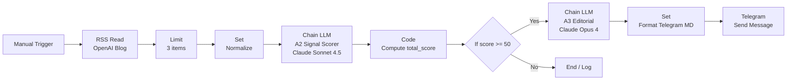
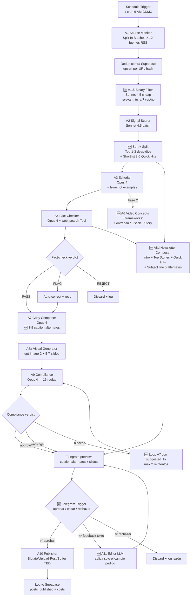

# N8N Workflow Skeleton — AI Brief LATAM

**Fecha:** 2026-05-12 (rev. 2 — incorpora deep review #12533)
**Status:** Diseño aprobado en sesión 4. Pendiente: implementación del JSON v2.
**Source de base:** template n8n #12533 (155 nodes) — vamos a usar ~10% del esqueleto y reemplazar el resto.

> **Revisión 2 (2026-05-12, tarde):** después de hacer la inspección profunda del JSON de #12533 (ver `projects/dinero-ia/docs/research/deep-research/n8n-templates-notes.md` § "Revisión profunda"), identificamos **8 patterns valiosos** que no estaban en el skeleton original. Esta revisión los integra:
>
> 1. **Filtro binario pre-scoring** — agregado entre A1 y A2 (ahorra 30-50% tokens)
> 2. **Top + Shortlist en A2** — el scorer ahora separa deep-dive vs Quick Hits
> 3. **Few-shot examples en A3** — referencia 2-3 briefs anteriores para consistencia
> 4. **Feedback-loop edit en HITL** — Telegram editor LLM aplica solo el cambio pedido
> 5. **N alternates en A7** — el composer entrega 3-5 captions, no 1
> 6. **Quick Hits section** — newsletter incluye stories shortlist
> 7. **Viral video frameworks** — 3 conceptos (Contrarian / Listicle / Story) para Fase 2
> 8. **1 cron + fan-out** (no 13 triggers separados, costo de ejecuciones)
>
> Fase 0 NO cambia (smoke test sigue siendo mínimo). Fase 1 sí cambia sustancialmente.

---

## Estrategia: 2 fases de implementación

| Fase | Nodes | Goal | Bloqueante para siguiente |
|---|---:|---|---|
| **Fase 0 — smoke test** | ~12 | Validar que la cadena Claude (scoring + editorial) llega a Telegram con un brief decente | Aprobación de Manuel del brief en Telegram |
| **Fase 1 — pipeline completo** | ~75-90 | 11 agents end-to-end con publish automático | Decisión publisher (ADR-014 Upload-Post) + Supabase schema + Telegram callback HITL |

**Por qué dos fases:** ir directo a Fase 1 con un JSON de 90 nodes nuevos es alto riesgo. Fase 0 valida que el corazón del pipeline (LLM scoring + LLM editorial + delivery a Telegram) funciona en condiciones reales antes de invertir en image gen, compliance, publishing.

---

## Fase 0 — Smoke test (target inmediato)

### Objetivo

Probar end-to-end:
1. Una fuente RSS (OpenAI Blog) entrega items reales
2. Claude Sonnet scorea con la rúbrica de 8 categorías
3. Un item con score >= 50 dispara el editorial
4. Claude Opus 4 genera un brief Smart Brevity con ángulo LATAM
5. El brief llega a Manuel por Telegram en menos de 2 minutos

Si esto funciona, sabemos que:
- ✅ El node Anthropic nativo de n8n funciona con nuestras API keys
- ✅ Los prompts (a2-signal-scorer.md, a3-editorial.md) producen output usable
- ✅ Telegram bot está bien configurado
- ✅ El JSON parsing entre nodes no se rompe en producción

Si NO funciona, sabemos exactamente en qué node se rompe (no entre 90 nodes).

### Arquitectura Fase 0 (Mermaid)



### Node-by-node spec

> Convenciones: cada bloque incluye el `type` exacto (para el JSON), parámetros mínimos, y el nodo del que recibe input.

#### 1. Manual Trigger
- **type:** `n8n-nodes-base.manualTrigger`
- **Parámetros:** ninguno (clic en "Execute Workflow" para correr)
- **Entrada:** ninguna
- **Salida:** trigger event
- **Razón:** evita complicar el smoke test con cron. Schedule Trigger se agrega en Fase 1.

#### 2. RSS Feed Read
- **type:** `n8n-nodes-base.rssFeedRead`
- **Parámetros:**
  - `url`: `https://openai.com/blog/rss.xml`
  - `options.ignoreSSL`: false
- **Entrada:** Manual Trigger
- **Salida:** array de items RSS con campos estándar (`title`, `link`, `pubDate`, `content`, `contentSnippet`)
- **Razón:** OpenAI Blog es una fuente confiable con feed RSS estable. Postergamos las 11 fuentes restantes a Fase 1.

#### 3. Limit
- **type:** `n8n-nodes-base.limit`
- **Parámetros:**
  - `maxItems`: 3
- **Entrada:** RSS Feed Read
- **Salida:** primeros 3 items
- **Razón:** no quemar tokens scoreando 20 items en una prueba.

#### 4. Set — Normalize Item
- **type:** `n8n-nodes-base.set`
- **Parámetros (mode = "raw" JSON):**
  ```json
  {
    "title": "={{ $json.title }}",
    "url": "={{ $json.link }}",
    "snippet": "={{ $json.contentSnippet || $json.content || '' }}",
    "source_name": "OpenAI Blog",
    "published_at": "={{ $json.pubDate }}",
    "tags": []
  }
  ```
- **Entrada:** Limit
- **Salida:** items normalizados al formato que el scorer espera
- **Razón:** los nombres de campos de RSS varían por feed; normalizamos acá para que el scorer reciba siempre la misma estructura.

#### 5. Chain LLM — A2 Signal Scorer
- **type:** `@n8n/n8n-nodes-langchain.chainLlm`
- **Parámetros:**
  - `promptType`: "define"
  - `text`: contenido de `projects/dinero-ia/prompts/a2-signal-scorer.md` → sección "User message template"
  - `hasOutputParser`: true
- **Sub-nodes (conectados como inputs):**
  - **Anthropic Chat Model** (`@n8n/n8n-nodes-langchain.lmChatAnthropic`)
    - Model: `claude-sonnet-4-5-20250929` (último Sonnet 4.5)
    - Temperature: 0.2
    - Max Tokens: 500
    - Credenciales: Anthropic API key (Manuel pega)
    - **System Message:** el system prompt completo de `a2-signal-scorer.md`
  - **Structured Output Parser** (`@n8n/n8n-nodes-langchain.outputParserStructured`)
    - Schema (JSON): el schema definido al final de `a2-signal-scorer.md`
- **Entrada:** Set (Normalize Item)
- **Salida:** JSON con `relevancia_latam`, `novedad`, …, `justification`, `suggested_angle`, `risk_flags`
- **Razón:** Sonnet es 5× más barato que Opus para scoring batch. La rúbrica está bien definida, no requiere "creatividad" de Opus.

#### 6. Code — Compute total_score
- **type:** `n8n-nodes-base.code`
- **Lenguaje:** JavaScript
- **Código:**
  ```javascript
  const data = $input.item.json;
  const score = (data.relevancia_latam || 0) +
                (data.novedad || 0) +
                (data.urgencia || 0) +
                (data.credibilidad_fuente || 0) +
                (data.potencial_educativo || 0) +
                (data.potencial_viral || 0) +
                (data.fit_marca || 0) +
                (data.riesgo || 0);

  let classification = 'discard';
  if (score >= 70) classification = 'strong';
  else if (score >= 50) classification = 'consider';

  return {
    ...data,
    total_score: Math.round(score * 100) / 100,
    classification,
  };
  ```
- **Entrada:** Chain LLM (A2)
- **Salida:** mismo item con `total_score` y `classification` agregados
- **Razón:** sumar 8 campos en una expresión n8n inline es feo. Code node lo aísla.

#### 7. If — Score Threshold
- **type:** `n8n-nodes-base.if`
- **Condición:**
  - `{{ $json.total_score }}` `>=` `50`
- **Entrada:** Code (Compute total_score)
- **Salida true:** → Chain LLM (A3)
- **Salida false:** → ¿qué? Para Fase 0, conectar a un Set de log o dejar suelto.
- **Razón:** threshold 50 (no 70) en Fase 0 para garantizar que algo pase. En Fase 1 subimos a 65-70.

#### 8. Chain LLM — A3 Editorial
- **type:** `@n8n/n8n-nodes-langchain.chainLlm`
- **Parámetros:**
  - `promptType`: "define"
  - `text`: contenido de `projects/dinero-ia/prompts/a3-editorial.md` → sección "User message template"
  - `hasOutputParser`: true
- **Sub-nodes:**
  - **Anthropic Chat Model**
    - Model: `claude-opus-4-20250514` (Opus 4)
    - Temperature: 0.4
    - Max Tokens: 1500
    - **System Message:** el system prompt completo de `a3-editorial.md`
  - **Structured Output Parser** con el schema del brief
- **Entrada:** If (true branch)
- **Salida:** JSON con todos los campos del brief: `title`, `que_paso`, `por_que_importa`, `angulo_latam`, `hook_tentativo`, etc.
- **Razón:** Opus 4 acá vale los $20-30/mes extra por la calidad del hook.

#### 9. Set — Format Telegram MD
- **type:** `n8n-nodes-base.set`
- **Parámetros (mode = "raw"):**
  ```json
  {
    "telegram_text": "*🟢 AI Brief LATAM — preview*\n\n*{{ $json.title }}*\nScore: {{ $('Code').item.json.total_score }}/100\n\n*¿Qué pasó?*\n{{ $json.que_paso }}\n\n*¿Por qué importa?*\n{{ $json.por_que_importa }}\n\n*Ángulo LATAM:*\n{{ $json.angulo_latam }}\n\n*Hook tentativo:*\n_{{ $json.hook_tentativo }}_\n\n*Datos clave:*\n• {{ $json.datos_clave.join('\\n• ') }}\n\n*Formato recomendado:* {{ $json.formato_recomendado }}\n*CTA:* {{ $json.cta_tentativo }}\n\n*Fuente:* {{ $('Set').item.json.url }}"
  }
  ```
- **Entrada:** Chain LLM (A3)
- **Salida:** `{telegram_text: "...markdown..."}`
- **Razón:** Telegram MarkdownV2 tiene escape rules raras, usamos Markdown clásico (`parse_mode: "Markdown"`) que es más permisivo.

#### 10. Telegram — Send Message
- **type:** `n8n-nodes-base.telegram`
- **Parámetros:**
  - `operation`: "sendMessage"
  - `chatId`: `{{ $credentials.chat_id }}` o hardcoded (mejor en credentials)
  - `text`: `={{ $json.telegram_text }}`
  - `additionalFields.parseMode`: "Markdown"
- **Credenciales:** Telegram API (con bot token de `@BotFather`)
- **Entrada:** Set (Format Telegram MD)
- **Salida:** confirmación de envío
- **Razón:** node Telegram oficial de n8n maneja retries y rate limits automáticamente.

### Lo que del template #12533 NO usamos en Fase 0

- Los 13 Schedule Trigger nodes (usamos 1 Manual Trigger)
- Los 6 RSS Feed Read Trigger originales (usamos 1, nuestra fuente)
- Los 11 Slack nodes (swap a 1 Telegram)
- Los 3 Reddit nodes (postergamos Reddit a Fase 1)
- Los 12 HTTP Request nodes (Anthropic via node nativo, no HTTP)
- Los 2 Google Sheets nodes (postergamos dedup a Fase 1)
- Las 16 sticky notes del autor original (las nuestras se agregan después)
- Los 9 chainLlm con prompts genéricos (reemplazamos con nuestros 2 prompts)

**Total: borramos ~143 de 155 nodes. Conservamos esencialmente el patrón "RSS → normalize → LLM → branch → LLM → output" pero con nuestros prompts y target.**

### Credenciales requeridas en n8n cloud

| Credencial | Valor | Cómo obtenerla |
|---|---|---|
| `Anthropic API` | sk-ant-… | https://console.anthropic.com/settings/keys |
| `Telegram` | bot token | Hablar con `@BotFather` en Telegram → `/newbot` → seguir prompts |
| `chat_id` (no es credencial, va hardcoded) | tu user ID | Escribirle al bot, después `curl "https://api.telegram.org/bot<TOKEN>/getUpdates"` para ver tu `chat.id` |

---

## Fase 1 — Pipeline completo (referencia, NO implementar todavía)

Solo se construye cuando Fase 0 entregue ≥3 briefs decentes en Telegram (≥1 al día durante 3 días).

> **Cambio mayor vs rev.1:** se introdujeron 6 elementos arquitectónicos nuevos por la deep review de #12533. Marcados con 🆕.

### Arquitectura Fase 1 (alto nivel, rev. 2)



### Lo que cambia respecto a rev.1

| Cambio | Origen | Por qué |
|---|---|---|
| 🆕 A1.5 Binary Filter | #12533 `evaluate_content` | Filtra obvios irrelevantes con Sonnet cheap (max_tokens=50) antes de quemar tokens en el scorer detallado. Ahorra 30-50% del costo de A2. |
| 🆕 Sort + Split top/shortlist | #12533 `pick_top_stories` | A2 ya score-ea individual; ahora separamos top 1-3 (deep-dive) de shortlist 3-5 (Quick Hits en newsletter). El "resto" se descarta. |
| 🆕 A3 con few-shot examples | #12533 `write_intro` | Pasar 2-3 briefs aprobados anteriores en el system prompt produce voz más consistente que prompts open-ended. |
| 🆕 A7 entrega 3-5 caption alternates | #12533 `write_subject_line` | En lugar de 1 caption, A7 produce varias variantes — Manuel elige la mejor en Telegram en vez de regenerar todo el brief. |
| 🆕 A8d Newsletter completa | #12533 newsletter structure | Estructura adoptada: Intro (sin "Buen día") + Top Stories (Smart Brevity sin meta-labels) + Quick Hits + Subject + Pre-header. |
| 🆕 A11 Editor LLM con feedback-loop | #12533 `edit_top_stories` | Manuel manda feedback de texto en Telegram ("la slide 3 está pixelada", "el ángulo está muy hype") → A11 aplica solo ese cambio, sin regenerar nada más. Pattern explícito: `<core_directive> must not introduce changes outside the feedback`. |
| 🆕 A6 Video Concepts (Fase 2) | #12533 `Generate Viral Video Ideas` | 3 frameworks ya definidos: Contrarian/Pattern Interrupt, Actionable Listicle/Hack, Story/Visual Metaphor. Reutilizables cuando arranque reels. |
| 1 cron + fan-out (no 13 triggers) | adaptación #12533 | El template original tenía 13 Schedule Triggers (uno por fuente, cada 3h = 104 ejecuciones/día). Lo reemplazamos por **1 cron diario + Split In Batches** para 12 fuentes en paralelo. Reduce el costo de ejecuciones a manejable. |
| Telegram bidireccional | gap del #12533 | El template solo tiene "send", no "listen". Agregamos **Telegram Trigger** para escuchar callbacks (inline buttons: aprobar / editar / rechazar) + replies con texto de feedback. Patrón inspirado en template #9472. |
| Newsletter como branch paralelo | nuevo | Antes era solo carrusel + caption. Ahora newsletter sale **del mismo pipeline** consumiendo top + shortlist. 1 invocación, 3 outputs. |

### Nodes nuevos respecto a Fase 0 (rev. 2)

| Bloque | Nodes | Razón |
|---|---:|---|
| Schedule Trigger + 12 RSS + dedup Supabase | ~18 (1 cron + Split In Batches × 12 + Supabase upsert + filter) | Reemplaza Manual Trigger + 1 RSS de Fase 0 |
| 🆕 A1.5 Binary Filter | 2 (Chain LLM cheap + If) | Filtro binario pre-scoring |
| A2 Signal Scorer + sort/split | 5 (Chain LLM + Code + Sort + Split + Limit) | Scoring + top/shortlist |
| A3 Editorial Opus 4 + few-shot | 3 (Chain LLM + parser + autofixing) | Brief con ejemplos |
| A4 Fact-Checker | 5 (AI Agent + web_search Tool + parser + retry + if-branch) | Pattern del template #4399 |
| A7 Copy Composer | 4 (Chain LLM + parser + alternates split + format) | Caption + 3-5 alternates + hashtags |
| A8a Visual Generator | 7-10 (HTTP Request × 5-7 imágenes + merge + Supabase Storage upload) | gpt-image-2 API loop |
| A8d Newsletter Composer | 5 (Chain LLM + parser + sections merge + subject alternates) | Newsletter completa |
| A9 Compliance + retry loop | 4 (Chain LLM + parser + if + loop counter) | 15 reglas + max 2 retries con suggested_fix |
| 🆕 Telegram HITL bidireccional | 8 (Send Message + inline keyboard + Telegram Trigger + parse callback + branch + Webhook wait) | Approve/edit/reject |
| 🆕 A11 Editor LLM | 3 (Chain LLM + parser + format Telegram MD) | Aplica edits del feedback humano sin regenerar |
| A10 Publisher | 3-5 | Depende de Blotato vs Upload-Post vs Buffer |
| Logging Supabase | 4 (insert briefs + insert posts_published + insert costs + execute query for analytics) | Persistencia |

**Total estimado Fase 1 rev.2: ~85-100 nodes** (vs 75-90 en rev.1; los +10-15 nodes son el costo de los 8 patterns adoptados).

### 🚨 Cost alert — plan n8n cloud

El deep review descubrió un costo escondido: 12 fuentes × polling múltiple + el resto del pipeline supera el plan Starter de n8n.

| Plan | Ejecuciones/mes | Costo | Cubre nuestro caso? |
|---|---:|---:|---|
| Starter | 2,500 | €20-24/mo | ❌ No (estimamos ~4,500/mes Fase 1) |
| Pro | 10,000 | €60/mo | ✅ Sí, con holgura |
| Self-hosted Hostinger | ilimitado | €5-7/mo VPS | ✅ Sí, pero requiere mantenimiento |

**Decisión pendiente:** revisar `docs/STACK.md` que actualmente menciona Starter ($24/mo). Recomendación: empezar en Starter para Fase 0 (cabe), upgrade a Pro o switch a self-hosted antes de activar Fase 1 con polling diario.

### Open items para Fase 1 (no bloqueantes para Fase 0)

1. **ADR-014 — publisher:** Upload-Post (resuelve ADR-012). Pendiente confirmación Manuel.
2. **Schema Supabase:** tablas `dedup_history`, `briefs`, `posts_published`, `costs`, `compliance_log` + bucket `assets`. A diseñar.
3. **Telegram HITL bidireccional:** patrón completo (Trigger + inline keyboard + callback parse) — inspirado en #9472 y #5773. Decidir si lo importamos como base o lo construimos custom.
4. **Threshold de scoring:** Fase 0 usa 50. Subir a 65-70 una vez que haya data real.
5. **Cost monitoring real:** Opus 4 a $15/$75 per M tokens. A 1 pieza/día con A3 + A4 + A7 + A9 + A11 ~ 15K input + 5K output → ~$0.60/pieza → ~$18/mes Anthropic. + gpt-image-2 5-7 slides × $0.04 = ~$0.20/pieza → $6/mes OpenAI. + n8n Pro $60/mo + Supabase Free → **~$85/mes Fase 1 corriendo full**.
6. **Few-shot examples para A3:** necesitamos 2-3 briefs aprobados ANTES de activar A3 con few-shot. En Fase 0 corre sin ejemplos; los primeros briefs aprobados se convierten en los seeds.
7. **A11 Editor LLM prompt:** todavía no extraído del template. Cuando llegue Fase 1 HITL, extraer `edit_top_stories` de #12533 a `prompts/a11-editor.md`.

---

## Próximos pasos concretos

1. **Manuel:** crear Telegram bot vía `@BotFather`, mandar el token + tu chat_id por mensaje al chat.
2. **Yo (post recibir credenciales):** generar `12533-v2-fase0.json` con los 10 nodes de Fase 0. Commit + raw URL.
3. **Manuel:** importar v2 a n8n cloud (Import from URL como hicimos con v1), pegar credenciales Anthropic + Telegram.
4. **Manuel:** click "Execute Workflow" → esperar 30-60s → recibir brief en Telegram.
5. **Juntos:** evaluar calidad del brief. Si gusta, agendar Fase 1. Si no, iterar prompts.
