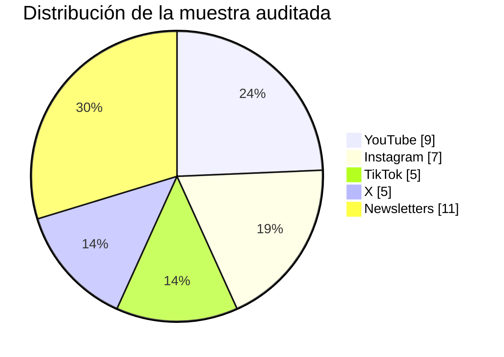

# Panorama competitivo de creadores de IA en español

## Resumen ejecutivo

La capa más visible del mercado hispanohablante de contenido sobre IA está claramente liderada por una combinación de perfiles de alto alcance en vídeo y unas pocas newsletters con audiencia relevante y monetización más madura. En la muestra auditada, los mayores polos de alcance público están en YouTube, Instagram y TikTok, con figuras como entity["people","Carlos Santana Vega","divulgador español de IA conocido como DotCSV"], entity["people","Xavier Mitjana","creador español de contenidos sobre IA"], entity["people","Jon Hernández","divulgador español de IA"], entity["people","Juan Merodio","consultor y divulgador español de IA y marketing"] y entity["people","Anas Andaloussi","emprendedor español de IA"]. En curación escrita, los nombres con mayor señal pública son urlIA en Españolturn1view3, urlExplicable | La newsletter del IIAturn50search0, urlIA News and Tools by ConsultoresIAturn27search1 y urlMafia IAturn25search0. citeturn4search0turn41search6turn42search1turn45search2turn12search5turn45search6turn1view3turn50search8turn23search1turn22search1

La oferta actual se concentra en cuatro posicionamientos dominantes. El primero es **divulgación generalista de herramientas y noticias**. El segundo es **IA aplicada a negocio/marketing/productividad**. El tercero es **IA para creadores y crecimiento en redes**. El cuarto es **curación por newsletter** con ángulo práctico o estratégico. Lo menos cubierto no es “más contenido sobre nuevas herramientas”, sino contenido de **implantación real**, **gobernanza**, **ROI**, **sectores regulados**, **casos LATAM muy localizados** y **comparativas rigurosas con fuentes y pruebas**. citeturn50search1turn23search1turn25search2turn21search3turn42search3turn48search6turn45search5

En monetización, el patrón es muy consistente: predominan **cursos y formaciones**, **consultoría**, **patrocinios/contacto comercial**, **afiliación**, **SaaS propios** y, en newsletters, **suscripción de pago**. En cambio, se ve menos peso relativo de **memberships comunitarios robustos**, **tips/donaciones** y **investigación premium de alto ticket** estilo analista. Esto sugiere un mercado todavía muy orientado a adquisición y conversión inmediata, más que a retención y producto editorial premium. citeturn21search3turn22search1turn25search5turn42search3turn45search5turn27search1turn37search1turn12search5

## Cómo leer esta base

La tabla siguiente cubre **37 cuentas activas** entre entity["country","España","país europeo"] y entity["place","Latinoamérica","región latinoamericana"], sin filtro geográfico adicional. “Activa” significa que encontré señales públicas recientes de publicación o recencia en perfiles, archivos, descripciones o herramientas de analítica pública. Cuando la plataforma no dejaba visible la cifra directamente en el perfil indexado, utilicé la **métrica pública más reciente accesible en herramientas de analítica indexadas**. Por eso verás algunas filas con **“unspecified”** en seguidores o frecuencia: prefiero marcar la opacidad antes que inventar precisión. En newsletters, cuando la landing oficial no era indexable, enlazo la página pública indexada más útil. Substack permite ocultar estadísticas públicas, así que el alcance de newsletters está subestimado frente a redes sociales. citeturn19search3turn22search1turn23search1turn41search6turn44search0turn45search1turn48search2

## Tabla maestra

### YouTube

| Cuenta | Plataforma | Alcance público | Frecuencia observada | Formatos | Monetización visible | Fortalezas | Debilidades | Evidencia |
|---|---|---:|---|---|---|---|---|---|
| url@DotCSVturn4search0 | YouTube | 913K suscr. | semanal–quincenal | vídeo largo, análisis, directos | ads, Patreon histórico, contacto comercial | máxima autoridad masiva en IA generalista en español | menor cadencia que short-form puro | citeturn4search0turn30search5 |
| url@DotCSVLabhttps://www.youtube.com/@DotCSVLab | YouTube | 238K suscr. | semanal aprox. | noticias, opinión, análisis | ads, patrocinios visibles por contacto comercial | muy fuerte para “news reaction” y actualidad | menos evergreen que el canal principal | citeturn4search0turn17search30 |
| url@XavierMitjanahttps://www.youtube.com/@XavierMitjana | YouTube | 342K suscr. | 3.23 vídeos/sem. | tutorial largo, review, casos de uso | ads, afiliados, academia, contacto comercial | ejecución práctica y ritmo alto | muy expuesto al “tool churn” | citeturn41search6turn42search4turn45search5 |
| url@joaquinbarberaaledohttps://www.youtube.com/@joaquinbarberaaledo | YouTube | 128K suscr. | ~2 vídeos/sem. | tutorial largo, how-to, demos | cursos, formaciones, agencia | claridad didáctica y foco tutorial | menos análisis crítico/estratégico | citeturn42search1turn42search3 |
| url@la_inteligencia_artificialhttps://www.youtube.com/@la_inteligencia_artificial | YouTube | unspecified | alta; millones de visitas mensuales | vídeo largo, noticias, explicación, comunidad | curso IA, master IA, club, libro | lenguaje masivo y puente al público mainstream | menor profundidad técnica que perfiles muy especializados | citeturn45search2turn48search6 |
| url@juanpe.divisualhttps://www.youtube.com/@juanpe.divisual | YouTube | 35.5K suscr. | unspecified | vídeo largo, agencia IA, automatización | academia/agencia, formación | muy claro para oportunidad de negocio y agencia IA | enfoque comercial más marcado que neutralidad analítica | citeturn43search1 |
| url@ElPresentadorOficialhttps://www.youtube.com/@ElPresentadorOficial | YouTube | 7.6K suscr. | unspecified | noticiero IA, clips, avatar | ads/pre-roll; no otra vía visible | posicionamiento diferencial como medio “AI-native” | escala todavía baja | citeturn43search1 |
| url@elprofesorottohttps://www.youtube.com/@elprofesorotto | YouTube | 15.3K suscr. | unspecified | tutoriales, recursos, automatización | formación, consultoría | mezcla útil de negocio + IA + enfoque humano | poca escala frente a líderes | citeturn43search0 |
| url@xhubaihttps://www.youtube.com/@xhubai | YouTube | 41.4K suscr. | regular / eventos y entrevistas | entrevistas, directos, comunidad | sponsors, BuyMeACoffee, PayPal | red de expertos y conversación técnica amplia | marca menos “personal”, tracción algorítmica menor | citeturn39youtube1 |

### Instagram

| Cuenta | Plataforma | Alcance público | Frecuencia observada | Formatos | Monetización visible | Fortalezas | Debilidades | Evidencia |
|---|---|---:|---|---|---|---|---|---|
| url@anasandaloussiiturn12search5 | Instagram | 446K seg. | alta / muy frecuente | reels, clips, lifestyle-emprendimiento | SaaS propio, management, funnels | narrativa aspiracional + distribución masiva | más “hustle/monetización” que rigor analítico | citeturn12search5turn33search5 |
| url@dotcsvhttps://www.instagram.com/dotcsv/ | Instagram | 103.8K seg. | 1–3 posts/mes aprox. | reels, carruseles, clips | contacto comercial visible | gran prestigio de marca e inbound a YouTube | no es su canal primario | citeturn32search0turn32search1 |
| url@bencordehttps://www.instagram.com/bencorde/ | Instagram | 228.7K seg. | alta / short-form intensivo | reels, ganchos virales, tutorial breve | anuncios, newsletter/lista, servicios | excelente máquina de adquisición y viralidad | profundidad irregular; muy growth-driven | citeturn32search3turn32search5turn32search7 |
| url@xavier_mitjanahttps://www.instagram.com/xavier_mitjana/ | Instagram | 82K seg. | ~3–4 posts/sem. | reels, clips didácticos | afiliados, academia, contacto comercial | gran traducción de tutorial largo a formato corto | menos ángulo executive/governance | citeturn42search5turn45search5 |
| url@jonhernandeziahttps://www.instagram.com/jonhernandezia/ | Instagram | 147.8K seg. | regular | reels, clips, funnel a formación | cursos, máster, club, libro | tono muy accesible y masivo | menos profundidad técnica que especialistas | citeturn45search4turn45search2turn48search6 |
| url@juanmerodiohttps://www.instagram.com/juanmerodio/ | Instagram | 338K seg. | baja: 0.11 posts/sem.; recencia hoy | reels, opinión, negocio | consultoría IA, cursos, libros, conferencias | fuerte reach ejecutivo/negocio | la IA compite con marketing y marca personal más amplia | citeturn45search6turn48search0 |
| url@sofia_mapehttps://www.instagram.com/sofia_mape/ | Instagram | 6.1K seg. | 3.23 posts/sem. | reels, microtips, marketing+IA | consultoría, docencia | nicho claro: IA generativa + marketing estratégico | todavía pequeña escala | citeturn45search1 |

### TikTok

| Cuenta | Plataforma | Alcance público | Frecuencia observada | Formatos | Monetización visible | Fortalezas | Debilidades | Evidencia |
|---|---|---:|---|---|---|---|---|---|
| url@dotcsvhttps://www.tiktok.com/@dotcsv | TikTok | 426.3K seg. | 0.55 posts/sem.; recencia 1 día | short video, news, clips | tráfico a YouTube, patrocinios/contacto | una de las mayores audiencias TT de IA en español | publica menos que otros TT nativos | citeturn44search0 |
| url@anasandaloussi10https://www.tiktok.com/@anasandaloussi10 | TikTok | 652.2K seg. | alta / varios por semana | short video, avatar AI, growth | SaaS propio, lead-gen, marca personal | brutal top-of-funnel en short-form | foco más comercial que pedagógico | citeturn18search2turn33search7 |
| url@jonhernandeziahttps://www.tiktok.com/@jonhernandezia | TikTok | 80.9K seg. | unspecified | short explainer, clips, opinión | cursos/master/club | tono simple y altamente compartible | menor escala relative a IG/YT | citeturn44search4turn48search6 |
| url@juanmerodiohttps://www.tiktok.com/@juanmerodio | TikTok | 11.9K seg. | unspecified | clips, negocio+IA | consultoría, cursos, speaking | buen encaje con audiencia directiva y pyme | TT todavía secundario en su mix | citeturn44search3turn48search0 |
| url@thomahimahttps://www.tiktok.com/@thomahima | TikTok | 60.1K seg. | unspecified | IA generativa, entretenimiento visual | colaboraciones probables; no otra vía visible | nativo del formato y de la estética IA | valor educativo/estratégico más bajo | citeturn44search2 |

### X

| Cuenta | Plataforma | Alcance público | Frecuencia observada | Formatos | Monetización visible | Fortalezas | Debilidades | Evidencia |
|---|---|---:|---|---|---|---|---|---|
| url@DotCSVturn34search2 | X | 194.8K seg. | activa | hilo breve, links, comentario, distribución | contacto comercial visible | uno de los mayores nodos de descubrimiento en IA española | X no parece su principal activo de conversión | citeturn34search2 |
| url@javilopenturn36search1 | X | 121K seg. | activa | demos, diseños, news, generative AI | fundador/empresa, distribución a otros activos | muy fuerte en inspiración visual y tool discovery | menos orientado a operación empresarial en español | citeturn36search1 |
| url@JonhernandezIAhttps://x.com/JonhernandezIA | X | 20K seg. | activa; posts con alta visualización | posts, hilos cortos, distribución de news | club, cursos, libro | buen rendimiento de distribución con base media | escala más modesta que líderes de X | citeturn48search2turn48search3 |
| url@alex_dchttps://x.com/alex_dc | X | 3.8K seg. | activa | build-in-public, oferta, funnels | newsletter premium, producto lifetime | audiencia pequeña pero muy alineada a monetización | alcance limitado para awareness masivo | citeturn37search1turn37search2 |
| url@javiiniguezturn40search21 | X | 2.6K seg. | activa | dev/IA, clips, distribución técnica | cursos, marca personal, YouTube | buena lectura “AI builder/coder” | nicho más adyacente que central | citeturn40search21 |

### Newsletters

| Cuenta | Plataforma | Alcance público | Frecuencia observada | Formatos | Monetización visible | Fortalezas | Debilidades | Evidencia |
|---|---|---:|---|---|---|---|---|---|
| urlIA en Españolturn1view3 | Newsletter | 48K subs. | cada 3 días | digest, noticias, apps | patrocinio probable; no pago visible en about | mayor escala visible en newsletter IA en español | enfoque generalista/curatorial | citeturn1view3 |
| urlExplicable | La newsletter del IIAturn50search0 | Newsletter | 16K+ subs. | diaria / muy frecuente | análisis, negocio, links | formación/instituto, webinars, consulting | muy fuerte en IA negocio y actualidad | menos orientada a creator economy o uso cotidiano | citeturn50search0turn50search1turn50search8 |
| urlIA News and Tools by ConsultoresIAturn27search1 | Newsletter | 13K+ subs. | semanal: viernes 12h | digest, noticias, tools | consultoría, formación | frecuencia clarísima y propuesta utilitaria | voz editorial menos diferenciada que líderes de autor | citeturn27search1turn23search1 |
| urlMafia IAturn25search0 | Newsletter | 17K subs. visibles; 15K+ free en directorio | bisemanal | prompts, guías, comunidad | patrocinio, pago, premium lifetime, comunidad | monetización muy madura y nicho emprendedor muy claro | sesgo comercial elevado / posible hype | citeturn25search0turn25search2turn22search1turn37search1 |
| urlEspacio Latenteturn25search3 | Newsletter | 8K+ subs. | no explicitada; activa | herramientas, IA generativa, creador | guías/activos propios | muy buena combinación de IA generativa + creatividad | frecuencia pública poco transparente | citeturn25search3 |
| urlAlgoritmo Transparenteturn25search5 | Newsletter | 6K+ subs. | semanal | análisis, news curation | suscripción de pago, comunidad | buen puente IA + medios + actualidad | mezcla temática más amplia que IA aplicada pura | citeturn22search3turn25search1turn25search5 |
| urlIA con Canasturn21search3 | Newsletter | unspecified | regular / semanal percibida | ensayos prácticos, casos, tips | curso, talleres, charlas, workshops | posicionamiento clarísimo para +35/no técnicos | escala pública oculta; poca prueba pública de volumen | citeturn21search3turn30search1turn21search4 |
| urlestrategIAturn21search0 | Newsletter | 1K+ subs. | no explicitada; activa | análisis IA en política y gobierno | institución educativa / formación | nicho único: gobierno y política | audiencia pequeña por vertical muy especializada | citeturn21search0 |
| urlGadeIAhttps://vicentgadea.substack.com/ | Newsletter | unspecified | twice weekly | educación, ética, estrategia docente | formación y reputación experta; no pago visible | uno de los pocos focos claros de IA en educación con criterio | escala pública no visible | citeturn51search1turn51search2 |
| urlSpacio*IAturn22search4 | Newsletter | 1K+ subs. | no explicitada; activa | actualidad IA | no visible | propuesta simple y legible: “estar al día” | poca diferenciación frente a digests generalistas | citeturn22search4 |
| urlIA Práctica por Ernestoturn22search0 | Newsletter | 1K+ subs. | no explicitada; activa | hacks, tools, casos prácticos | no visible | propuesta utilitaria muy clara | marca todavía pequeña | citeturn22search0 |

## Qué muestra realmente el mercado

La muestra tiene una distribución muy desigual. El **vídeo** domina el awareness; las **newsletters** dominan la claridad de propuesta y, en varios casos, la monetización directa.



El siguiente gráfico agrega solo la **métrica pública visible** por plataforma. No compara “influencia real”; compara la **señal pública accesible**. Por eso las newsletters salen muy abajo: muchas esconden o no exponen abiertamente suscriptores, algo que Substack permite. citeturn19search3

```mermaid
xychart-beta
    title Alcance público acumulado por plataforma en la muestra
    x-axis ["YouTube","Instagram","TikTok","X","Newsletters"]
    y-axis "Miles" 0 --> 1800
    bar [1721,1352,1231,342,111]
```

La lectura estratégica es clara. YouTube concentra la parte más fuerte del mercado de autoridad y archivo: canales como url@DotCSVturn4search0, url@XavierMitjanahttps://www.youtube.com/@XavierMitjana y url@joaquinbarberaaledohttps://www.youtube.com/@joaquinbarberaaledo son los mejores ejemplos de contenido reusable y buscable. Instagram y TikTok, en cambio, concentran las capas de descubrimiento y conversión rápida, con perfiles como url@anasandaloussiiturn12search5, url@bencordehttps://www.instagram.com/bencorde/ y url@dotcsvhttps://www.tiktok.com/@dotcsv. X funciona menos como casa principal y más como **capa de distribución, señal y opinión** para insiders, especialmente en url@DotCSVturn34search2 y url@javilopenturn36search1. citeturn4search0turn41search6turn42search1turn12search5turn32search3turn44search0turn34search2turn36search1

También se ve un sesgo geográfico: la capa indexada de mayor visibilidad está muy dominada por entity["country","España","país europeo"]. Los perfiles españoles aparecen una y otra vez en los rankings visibles de YouTube, Instagram, TikTok y X, mientras que la presencia LATAM en la muestra de referencia es más estrecha y suele estar más ligada a emprendimiento, productividad y educación no técnica que a investigación profunda o governance. citeturn42search4turn43search0turn45search1turn45search6turn36search1turn21search4turn32search3

Finalmente, la monetización visible muestra un mercado bastante “operatorio”: no se monetiza tanto por membresía editorial premium como por **servicios**, **infoproducto**, **comunidad**, **SaaS** y **afiliación**. Eso aparece con nitidez en urlMafia IAturn25search0, urlIA con Canasturn21search3, url@joaquinbarberaaledohttps://www.youtube.com/@joaquinbarberaaledo, url@juanmerodiohttps://www.instagram.com/juanmerodio/, url@anasandaloussiiturn12search5 y urlIA News and Tools by ConsultoresIAturn27search1. citeturn25search0turn22search1turn21search3turn42search3turn48search0turn12search5turn27search1

## Cinco huecos de posicionamiento no bien cubiertos

### Operación real por sector en español

Hay muchísimo contenido sobre “la nueva herramienta” y bastante menos sobre **cómo implantar IA en una función concreta**. Faltan creadores centrados, por ejemplo, en retail, logística, legal, inmobiliario, salud, back office financiero o atención al cliente en español, con playbooks completos, KPIs, privacidad, prompts, integración y errores frecuentes. Hoy ese espacio se toca tangencialmente desde negocio o formación, pero casi nunca con profundidad sectorial. citeturn50search0turn23search1turn21search3turn48search0turn42search3

### Gobierno, compliance y ROI para directivos hispanohablantes

Existe contenido para principiantes y existe contenido de herramientas; lo que falta es un liderazgo editorial fuerte sobre **gobernanza, política de datos, seguridad, coste, procurement, evaluación de vendors y retorno** para managers y C-level en español. urlExplicable | La newsletter del IIAturn50search0 y urlestrategIAturn21search0 se acercan, pero el hueco sigue grande y muy poco explotado en vídeo social masivo. citeturn50search0turn50search2turn21search0turn48search0turn36search4

### “Middle market LATAM” con ejemplos locales

La mayoría de los líderes visibles están en entity["country","España","país europeo"] o trabajan con ejemplos globales. Falta una voz dominante, especialmente en entity["place","Latinoamérica","región latinoamericana"], para pymes medianas y equipos no técnicos de México, Colombia, Chile, Perú o Argentina, con workflows, presupuestos, stacks y restricciones reales de esos mercados. Las excepciones visibles están más cerca de productividad o formación ejecutiva que de una cobertura operativa continua para pymes regionales. citeturn21search4turn32search3turn36search4turn23search4

### Benchmarking serio y “anti-hype” en español

El ecosistema está lleno de reviews, hacks y entusiasmo, pero faltan más marcas de contenido cuyo core sea **probar herramientas en condiciones similares**, comparar precisión/coste/velocidad, documentar fracasos y desmontar humo. Ese posicionamiento existe a ratos en creadores técnicos, pero no domina como categoría propia. Quien construya “Consumer Reports de la IA en español” puede diferenciarse con mucha claridad. citeturn41search6turn42search4turn50search1turn22search3

### Agentes y automatización con profundidad intermedia

Hay contenido básico y hay contenido muy técnico/coder. Falta una capa intermedia excelente: **agentes, copilotos, automatización y vibe coding aplicados a equipos funcionales**, con walkthroughs repetibles, modelos mentales, riesgos y mantenimiento. Hoy ese espacio está fragmentado entre promesa comercial, clips virales y tutoriales aislados. citeturn42search3turn43search1turn37search0turn40search21turn48search3

## Limitaciones y preguntas abiertas

Esta investigación es rigurosa, pero no “cerrada definitivamente”. Varias plataformas esconden métricas públicas o dificultan la indexación de perfiles, especialmente TikTok, Instagram, X y algunas newsletters. Por eso algunas filas usan analítica pública indexada y otras marcan “unspecified”. También hay cuentas híbridas —marketing + IA, creator economy + IA, desarrollo + IA— donde la frontera de “dedicado a IA” no es perfecta. La principal pregunta abierta no es quién publica, sino **quién convierte mejor audiencia en producto, comunidad y recurrencia**, algo que ya requiere datos privados de open rate, CTR, revenue y cohortes que no son públicos en la mayoría de los casos. citeturn19search3turn44search0turn45search1turn48search2