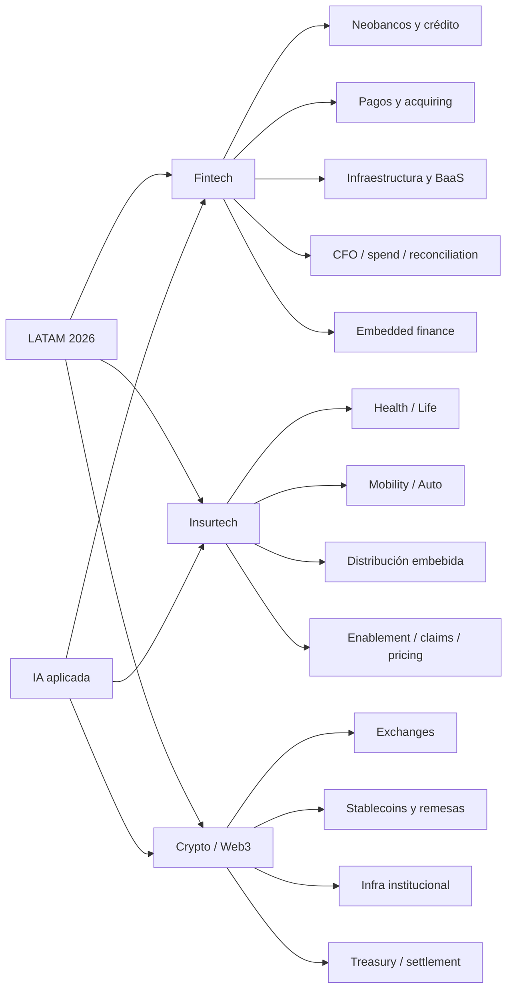

# Mapa del ecosistema fintech, insurtech y cripto en LATAM 2026

## Resumen ejecutivo

El mapa competitivo de 2026 en América Latina muestra tres hechos claros. Primero, el grueso del valor creado sigue concentrándose en fintech de infraestructura, pagos, crédito y banca digital, con liderazgo de entity["country","Brazil","South American country"] y entity["country","Mexico","North American country"] por volumen, mientras entity["country","Argentina","South American country"] y entity["country","Colombia","South American country"] destacan por densidad emprendedora y rounds emblemáticos como Ualá, Simetrik, Addi y Yuno. En 2024, el fintech latinoamericano levantó US$2.4 mil millones en 140 deals, con fuerte sesgo a tickets grandes; en startup VC total, 2024 mostró recuperación regional de 26% según Endeavor/Glisco, y el rebote continuó en 2025 hacia compañías más maduras. citeturn2search5turn2search8turn3news35

Segundo, insurtech y cripto están vivos pero con disclosure mucho más desigual. En insurtech, el punto no es solo financiamiento: el ecosistema llegó a más de 500 startups regionales y en el primer semestre de 2025 captó US$121 millones, con claro dominio brasileño y un corrimiento desde “distribución pura” hacia salud, movilidad y enablement. En cripto, la región se volvió un caso de uso real de pagos, stablecoins y cobertura inflacionaria: entre julio de 2022 y junio de 2025 acumuló casi US$1.5 billones en volumen on-chain, con entity["country","Brazil","South American country"] a la cabeza y entity["country","Argentina","South American country"], entity["country","Mexico","North American country"] y entity["country","Colombia","South American country"] como mercados de uso intensivo. citeturn2search9turn2search3turn3search1

Tercero, la IA ya no es “tema de PR” sino capa de producto. En Colombia, Finnovista reportó que dos tercios de las fintech ya implementan IA, sobre todo para decisión crediticia, automatización, servicio al cliente y fraude. En la capa líder del ranking, la IA aparece sobre todo en underwriting, antifraude, conciliación financiera, routing de pagos, cobranza y soporte; lo menos visible son modelos fundacionales propios. La regla general del mercado es otra: datasets transaccionales propietarios + scoring/ML propio + LLMs de terceros para atención y back office. citeturn1search30turn7search1turn14search2turn31search6

La lectura editorial para un newsletter especializado es potente: todavía no existe, en español o portugués, un producto dominante que conecte **funding + producto + regulación + IA aplicada + unit economics** para este universo. Ese hueco es especialmente visible en embedded finance, open finance, insuretech operacional, stablecoins B2B y CFO software regional. citeturn16search4turn32news44turn2search9turn14search2

## Metodología y límites

Este reporte usa una definición operativa de “startup” amplia: compañías tecnológicas privadas e independientes, venture-backed o growth-backed, activas en LATAM a la fecha del reporte. Se excluyeron incumbentes públicos o corporativos no-startup, y empresas adquiridas que ya no operan como entidad independiente. El ranking no pretende replicar valuación privada ni market share; es una clasificación analítica que pondera cuatro variables: capital 2024-2026, huella geográfica, relevancia estratégica por vertical y evidencia pública de tracción o producto. citeturn2search5turn3news35

En la tabla maestra, los montos se reportan **como fueron divulgados públicamente**. Cuando el source habla de venture debt, FIDC, línea de crédito, facility o estructuración de funding, se incluye porque en la práctica financia originación, expansión o balance-sheet growth; cuando el monto no fue revelado, se marca **unspecified**. El mismo criterio aplica para educación, background previo, serial founder status, unit economics y headcount. En insurtech y cripto, la opacidad pública sigue siendo más alta que en fintech B2B/B2C, por lo que el número de celdas “unspecified” es materialmente mayor. citeturn20news48turn23search0turn32news44turn28search7

**Leyenda de mercados foco:** MX = entity["country","Mexico","North American country"], BR = entity["country","Brazil","South American country"], CO = entity["country","Colombia","South American country"], AR = entity["country","Argentina","South American country"], CL = entity["country","Chile","South American country"]. Una celda vacía o “unspecified” en mercados no significa ausencia operativa; significa que no pude confirmarlo con evidencia pública suficientemente sólida dentro del tiempo de investigación.  

## Panorama regional

La frontera más importante del ecosistema no separa países sino **capas de negocio**. Las empresas que mejor resistieron 2024-2026 son las que ocupan infraestructura crítica: emisión y procesamiento de tarjetas, open finance, lending rails, reconciliation, spend management, BaaS, cobros y ruteo. Ahí se explica por qué nombres como Ualá, Stori, Klar, Clip, Neon, CloudWalk, Celcoin, QI Tech, Simetrik, Belvo, Pomelo, Yuno y Mendel concentran buena parte del mapa de relevancia de 2026. citeturn7search0turn5search8turn9search0turn22search0turn9search2turn25search1turn14news48turn16search4turn15search0turn14search1turn31search0

En insurtech, el capital todavía premia menos el “front-end de venta” que la propuesta de riesgo o la integración operativa. De ahí el interés en embedded insurance, salud digital asegurada, claims automation, telemática y modelos híbridos de MGA/tech-enablement. En paralelo, cripto se está normalizando menos como “trading story” y más como riel de pagos, treasury, remesas y stablecoins. Chainalysis señala que los flujos vía exchanges centralizados siguen dominando LATAM, y el protagonismo de stablecoins es especialmente visible en Brasil, Argentina y Colombia. citeturn2search9turn3search1

El mapa conceptual de 2026 puede representarse así:

La tesis transversal es que la **IA aplicada a decisión financiera** está capturando más valor que la IA “genérica”. Donde sí hay señales públicas fuertes es en scoring alternativo, fraude, soporte, conciliación, OCR/receipt audit, collections, account verification, routing y underwriting embebido. Donde casi no hay disclosure público es en IP de modelos base o modelos propios entrenados desde cero. Eso sugiere un mercado de software financiero “AI-native”, pero no todavía un mercado de foundation models financieros latinoamericanos con suficiente evidencia pública. citeturn6search0turn7search1turn14search2turn16search2turn31search6turn33search7

## Tabla maestra

**Tabla maestra, tramo superior**  
*(campos “unspecified” indican falta de disclosure robusto en fuentes abiertas revisadas)*

| Rank | Startup | Vertical / subvertical | HQ | Mercados foco | 2024 funding | 2025 funding | 2026 funding | Total 2024-26 | Último round y fecha | Fundadores | IA diferenciadora | Modelo de negocio | Inversores clave | Empl. | Notas / fuentes |
|---|---|---|---|---|---:|---:|---:|---:|---|---|---|---|---|---|---|
| 1 | urlUaláhttps://www.uala.com | Fintech / neobanco | AR | AR, MX, CO | US$300m | US$66m | 0 | US$366m | Serie E + extensión, nov-2024 / mar-2025 | Pierpaolo Barbieri; bg. adicional unspecified | Sí: UaláScore + GPT-4 en soporte | Interchange, crédito, inversión, loyalty | Allianz X; TelevisaUnivision | unspecified | 8M+ usuarios; expansión en AR/MX/CO. citeturn7search0turn7search1turn7search3 |
| 2 | urlStorihttps://www.storicard.com | Fintech / tarjeta+depósitos | MX | MX, CO | US$212m | 0 | 0 | US$212m | Equity+debt, ago-2024 | Bin Chen, Marlene Garayzar, Sherman He, Nick Chen | No claro públicamente | Tarjetas, depósitos, préstamos | Notable, BAI, Goldman Sachs, Davidson Kempner | unspecified | 3M+ clientes en MX; entrada a CO anunciada. citeturn5search8turn5search6turn5search9 |
| 3 | urlKlarhttps://www.klar.mx | Fintech / neobanco | MX | MX | 0 | US$190m* | 0 | US$190m* | Serie C, 2025 | Stefan Moller, Daniel Autrique | No claro públicamente | Interchange, interés, cash advance, premium | General Atlantic | 251-500 | *Monto 2025 reportado por fuente secundaria. citeturn8search2turn4search1 |
| 4 | urlCliphttps://www.payclip.com | Fintech / pagos SMB | MX | MX | US$100m | 0 | 0 | US$100m | Investment round, jun-2024 | Adolfo Babatz; bg. adicional unspecified | No claro públicamente | Adquirencia, hardware/software, crédito | Morgan Stanley Tactical Value | unspecified | Plataforma de comercio y pagos para SMB. citeturn9search0turn9search4turn9search7 |
| 5 | urlCreditashttps://www.creditas.com | Fintech / secured lending | BR | BR, MX | 0 | R$800m FIDC | 0 | R$800m | FIDC, jul-2025 | Sergio Furio (ex BCG, Deutsche Bank) | No claro públicamente | Crédito con garantía + seguros + beneficios | Kaszek y otros; FIDC institucional | 1900 | Opera en BR y MX; fuerte foco en collateral. citeturn21search1turn21search8turn21search10 |
| 6 | urlNeonhttps://neon.com.br | Fintech / banco digital | BR | BR | 0 | R$720m | 0 | R$720m | Serie E, jul-2025 | Pedro Conrade; bg. adicional unspecified | Sí: inversión anunciada en IA; uso no detallado | Cuenta, tarjeta, crédito, inversión | IFC, DEG, BBVA, General Atlantic | unspecified | 32M clientes; primer trimestre rentable en 2025. citeturn23search0turn23search6turn22search0turn22search1 |
| 7 | urlCloudWalkhttps://www.cloudwalk.io | Fintech / acquiring+crédito | BR | BR | 0 | R$7.34bn** | 0 | R$7.34bn** | FIDC, oct-2025 | founders/background unspecified | Sí: AI products + autonomous credit infra | Adquirencia, anticipos, crédito, CDB | bancos y vehículos FIDC | unspecified | **Suma de FIDCs públicos 2025 consultados. citeturn9search1turn9search2turn9search3 |
| 8 | urlBitsohttps://bitso.com | Crypto / exchange+infra | MX | MX (otros mercados LATAM no confirmados aquí) | 0 | 0 | 0 | 0 | Sin ronda pública 2024-26 identificada | Daniel Vogel, Ben Peters, Pablo Gonzalez | No claro públicamente | Trading, custody, rails cripto | Coatue, Tiger Global y otros | 501-1000 | Activa; intercambio cripto líder de origen mexicano. citeturn8search1turn3search1 |
| 9 | urlClarahttps://www.clara.com | Fintech / spend management B2B | BR | BR, MX, CO | 0 | 0 | 0 | 0 | Sin ronda pública 2024-26; referencia previa 2023 | founders/background unspecified | No claro públicamente | Tarjetas corporativas, AP, pagos, FX | Monashees, Coatue; líneas deuda | unspecified | Opera BR/MX/CO; Brasil cerca de break-even en 2024. citeturn9news48 |
| 10 | urlCelcoinhttps://www.celcoin.com.br | Fintech / BaaS+embedded finance | BR | BR | US$125m / R$650m | 0 | 0 | US$125m / R$650m | Serie C, jun-2024 | Marcelo França, Adriano Meirinho | No claro públicamente | Infra de pagos, banking y lending | Summit Partners, Innova Capital | 251-500 | 6k+ clientes no financieros y 600 financieros. citeturn25search1turn25search4turn24search0 |

| Rank | Startup | Vertical / subvertical | HQ | Mercados foco | 2024 funding | 2025 funding | 2026 funding | Total 2024-26 | Último round y fecha | Fundadores | IA diferenciadora | Modelo de negocio | Inversores clave | Empl. | Notas / fuentes |
|---|---|---|---|---|---:|---:|---:|---:|---|---|---|---|---|---|---|
| 11 | urlQI Techhttps://qitech.com.br | Fintech / infra financiera | BR | BR | US$50m ext. Serie B | 0 | 0 | US$50m | Extensión Serie B, abr-2024 | Pedro Mac Dowell, Marcelo Bentivoglio, Marcelo Buosi | No claro públicamente | APIs de crédito, pagos, banking, antifraude | General Atlantic, Across Capital | unspecified | Primer unicornio fintech de BR en 2024. citeturn20news48turn20search1turn20search2 |
| 12 | urlSimetrikhttps://www.simetrik.com | Fintech / reconciliation CFO stack | CO | MX, BR, AR, CO | US$55m | 0 | 0 | US$55m | Serie B, feb-2024 | Alejandro Casas Caro, Santiago Gómez González | Sí: genAI + no-code building blocks | SaaS enterprise para conciliación, controles y reporting | Goldman Sachs Alternatives | 251-500 | 35+ países; fuerte base laboral en LATAM. citeturn14news48turn14search2turn8search0 |
| 13 | urlAddihttps://co.addi.com | Fintech / BNPL+lending | CO | CO | US$100m facility | 0 | 0 | US$100m | Credit facility, nov-2024 | Santiago Suárez; bg. adicional unspecified | No claro públicamente | BNPL checkout + crédito | Victory Park Capital | unspecified | Rentable en 2024; casi 2M clientes y 18k merchants. citeturn14search5turn14search6 |
| 14 | urlPomelohttps://pomelo.la | Fintech / issuer-processing | AR | BR, MX, CO, CL | 0 | 0 | 0 | 0 | Sin ronda pública 2024-26 identificada | Gastón Irigoyen (ex Naranja X, Google), Hernán Corral (ex Mercado Pago), Juan Fantoni (ex Mastercard) | No claro públicamente | Fees de emisión, procesamiento, risk y BIN sponsorship | unspecified | unspecified | Líder regional en emisión/procesamiento según sitio. citeturn15search0turn15search3turn15search5turn15search7 |
| 15 | urlMendelhttps://mendel.com | Fintech / enterprise spend+travel | MX | MX, AR, CO, CL | 0 | US$35m | 0 | US$35m | Serie B, mar-2025 | Alan Karpovsky, Alejandro Zecler, Helena Polyblank, Gonzalo Castiglione | Sí: agentes AI para auditoría, comprobantes, soporte y travel | SaaS + pagos + travel mgmt | Base10, PayPal Ventures, Endeavor Catalyst | 80 | Expansión a CL/CO/PE en 2025 y BR en 2026. citeturn31search0turn31search2turn31search6 |
| 16 | urlBelvohttps://belvo.com | Fintech / open finance | MX | MX, BR | 0 | US$15m | 0 | US$15m | New round, abr-2025 | Pablo Viguera, Oriol Tintoré | Sí: AI-powered insights, income/employment scoring | APIs de datos, pagos e insights | Quona, Kaszek, Citi Ventures | unspecified | Opera entre MX y BR; foco claro en IA de data. citeturn16search4turn16search1turn16search2turn16search8 |
| 17 | urlYunohttps://y.uno | Fintech / payments orchestration | CO | LatAm amplia; foco local unspecified | US$25m | 0 | 0 | US$25m | Serie A, mar-2024 | Juan Pablo Ortega y equipo ex-Rappi | Sí: routing y automatización con IA | SaaS / orchestration / fraud / routing | DST, a16z, Tiger, Kaszek, Monashees | unspecified | 1,000+ métodos de pago; 200+ países soportados. citeturn14search1turn14search4turn14search7 |
| 18 | urlTokuhttps://www.trytoku.com | Fintech / recurring payments+collections | CL | CL, MX, BR | US$9.3m | US$48m | 0 | US$57.3m | Serie A ext., abr-2025 | Cristina Etcheberry, Francisca Noguera, Enzo Tamburini | Sí: optimiza cobranza con data en tiempo real; AI no detallada como stack propio | SaaS de recaudación y pagos recurrentes | Oak HC/FT, Gradient, F-Prime | unspecified | 450+ clientes; procesa US$1.8bn/año. citeturn18search0turn18search2turn18search7 |
| 19 | urlXepelinhttps://xepelin.com | Fintech / B2B credit+cash mgmt | CL | CL, MX | 0 | 0 | 0 | 0 | Sin ronda pública 2024-26 identificada | founders/bg. unspecified aquí | No claro públicamente | Factoring, pagos a proveedores, banking Suite | unspecified | unspecified | 60k+ empresas; US$5bn financiados en 3 años. citeturn17search1turn17search4turn17search5 |
| 20 | urlKueskihttps://www.kueski.com | Fintech / lending+BNPL | MX | MX | 0 | 0 | 0 | 0 | Sin ronda pública 2024-26 identificada | founders/bg. unspecified aquí | Sí: ML underwriting y AI-driven decisioning | Interés, merchant fees BNPL | unspecified | unspecified | Opera solo en MX; ML es pieza central del underwriting. citeturn6search0turn6search2turn6search5turn6search4 |

**Tabla maestra, tramo medio**

| Rank | Startup | Vertical / subvertical | HQ | Mercados foco | 2024 funding | 2025 funding | 2026 funding | Total 2024-26 | Último round y fecha | Fundadores | IA diferenciadora | Modelo de negocio | Inversores clave | Empl. | Notas / fuentes |
|---|---|---|---|---|---:|---:|---:|---:|---|---|---|---|---|---|---|
| 21 | urlCorahttps://www.cora.com.br | Fintech / SMB bank | BR | BR | 0 | 0 | 0 | 0 | Sin ronda pública 2024-26 identificada | Igor Senra, Leo Tardin; bg. resumido no detallado aquí | Sí: foco público 2026 en expandir crédito con IA | Cuenta PJ, crédito, analytics | Kaszek, QED, Ribbit | ~350 | Rentable desde fin de 2024; 1.7M cuentas. citeturn26search0turn26search7turn26search3 |
| 22 | urlConta Simpleshttps://contasimples.com | Fintech / corporate spend | BR | BR | US$41.5m | 0 | 0 | US$41.5m | Serie B, ene-2024 | Rodrigo Tognini, Taeli Klaumann | No claro públicamente | Plataforma financiera y tarjetas corporativas | Base10, Valor, YC | unspecified | Llegó a breakeven en 2023. citeturn26search4turn26search9 |
| 23 | urlKushkihttps://www.kushki.com | Fintech / paytech regional | EC | MX, BR, CO, CL | 0 | 0 | 0 | 0 | Sin ronda pública 2024-26 identificada | Aron Schwarzkopf, Sebastian Castro y equipo | No claro públicamente | Procesamiento omnicanal y payouts | Hedosophia, Kaszek | 501-1000 | Opera en MX/BR/CO/CL y más; fuerte exposición enterprise. citeturn19search0turn17search6 |
| 24 | urlR2https://r2.co | Fintech / embedded lending | MX | MX, BR, CO, CL | 0 | unspecified | 0 | unspecified | Inversión estratégica, oct-2025 | Roger Larach, Roger Teran | Sí: underwriting y risk con IA; alianza Ant | Revenue-based financing vía APIs | Ant International; Gradient; GC | ~79* | 100k+ SMEs financiadas; *fuente secundaria para headcount. citeturn32search2turn32news44turn33search0turn33search7 |
| 25 | urlAplazohttps://aplazo.mx | Fintech / BNPL | MX | MX | US$70m | US$35.5m debt | US$14.5m LOC* | US$105.5m + LOC* | Línea BBVA, feb-2025; LOC II, mar-2026* | Ángel Peña, Alex Wieland | Sí: AI para mejor entendimiento/risk decisions | Merchant fees + BNPL financing | QED, Volpe, BBVA Spark | unspecified | *2026 monto visible en fuente secundaria CBI. citeturn10search7turn10search8turn10search2turn10search4 |
| 26 | urlAgrolendhttps://agrolend.agr.br | Fintech / agrifintech lending | BR | BR | US$53m | unspecified / JICA investment | 0 | US$53m + unspecified | JICA investment, may-2025 | founders/bg. unspecified | No claro públicamente | Crédito agro + funding LCA | Creation, Syngenta GV, JICA | unspecified | R$2bn concedidos; 10k productores; JICA no divulgó monto en el PR abierto. citeturn27search3turn28search7turn27search1 |
| 27 | urlBaubaphttps://www.baubap.com | Fintech / microlending | MX | MX | US$120m debt | 0 | 0 | US$120m | Debt financing, feb-2024 | Roberto Salcedo, Luis Villarreal, Conrad Wilkinson Schwarz | Sí: alternativa data + ML/AI | Micropréstamos vía app | SixPoint | 11-50 | 1.5M+ personas atendidas; Android-first. citeturn12search5turn13search0turn11search1 |
| 28 | urlStark Bankhttps://starkbank.com | Fintech / corporate bank infra | BR | BR | 0 | 0 | 0 | 0 | Último round visible previo: Serie B, abr-2022 | Rafael Stark | No claro públicamente | Banking corporativo vía APIs | Bezos Expeditions, Ribbit | 51-100 | 2024-26 sin ronda pública identificada. citeturn30search0turn30search3 |
| 29 | urlFintualhttps://fintual.cl | Fintech / wealthtech | CL | CL | 0 | 0 | 0 | 0 | Sin ronda pública 2024-26 identificada | founders/bg. unspecified aquí | No claro públicamente | Comisiones de inversión/wealth | unspecified | unspecified | AGF regulada por CMF chilena. citeturn17search2 |
| 30 | urlMercado Bitcoinhttps://www.mercadobitcoin.com.br | Crypto / exchange | BR | BR | 0 | 0 | 0 | 0 | Sin ronda pública 2024-26 identificada | founders/background unspecified | No claro públicamente | Trading, custody, tokenización | unspecified | unspecified | Chainalysis la ubica como uno de los nombres-hogar del cripto regional. citeturn3search1 |

| Rank | Startup | Vertical / subvertical | HQ | Mercados foco | 2024 funding | 2025 funding | 2026 funding | Total 2024-26 | Último round y fecha | Fundadores | IA diferenciadora | Modelo de negocio | Inversores clave | Empl. | Notas / fuentes |
|---|---|---|---|---|---:|---:|---:|---:|---|---|---|---|---|---|---|
| 31 | urlRipiohttps://www.ripio.com | Crypto / exchange+wallet | AR | AR | 0 | 0 | 0 | 0 | Sin ronda pública 2024-26 identificada | founders/bg. unspecified aquí | No claro públicamente | Trading, wallet, yield/rails | unspecified | unspecified | Referente regional de origen argentino citado en Chainalysis. citeturn3search1 |
| 32 | urlFélix Pagohttps://www.felixpago.com | Fintech / remesas | MX | MX, CO | US$15.5m | 0 | 0 | US$15.5m | Serie A, may-2024 | Manuel Godoy, Bernardo García | Sí: interfaz conversacional en WhatsApp | Fees FX/remittance | unspecified | unspecified | 300k+ migrantes; remesas desde WhatsApp. citeturn32search3turn32search0 |
| 33 | urlKonfíohttps://konfio.mx | Fintech / SME lending | MX | MX | unspecified | unspecified | unspecified | unspecified | unspecified | unspecified | No claro públicamente | Crédito PYME + pagos + servicios | unspecified | unspecified | Startup relevante del stack PYME; disclosure reciente limitado en fuentes revisadas. |
| 34 | urlMundihttps://mundi.io | Fintech / trade finance | MX | MX | unspecified | unspecified | unspecified | unspecified | unspecified | unspecified | No claro públicamente | Financiamiento de comercio exterior | unspecified | unspecified | Evidencia pública reciente revisada insuficiente para detallar 2024-26. |
| 35 | urlMinuhttps://www.minu.mx | Fintech / EWA+benefits | MX | MX | unspecified | unspecified | unspecified | unspecified | unspecified | unspecified | No claro públicamente | Fee B2B por wellness/benefits | unspecified | unspecified | Disclosure reciente revisada insuficiente. |
| 36 | urlSamihttps://www.samisaude.com.br | Insurtech / health | BR | BR | unspecified | unspecified | unspecified | unspecified | unspecified | unspecified | Sí probable en care/risk; no detallado públicamente aquí | Membresía/salud+aseguramiento | unspecified | unspecified | Incluida por relevancia sectorial; lag de disclosure público. |
| 37 | urlBetterflyhttps://betterfly.com | Insurtech / benefits+wellness | CL | CL | unspecified | unspecified | unspecified | unspecified | unspecified | unspecified | Sí: wellness/engagement driven; no stack público detallado aquí | B2B benefits, insurance attachment | unspecified | unspecified | Relevante en beneficios/seguros digitales; datos 2024-26 incompletos. |
| 38 | urlJustoshttps://www.justos.com.br | Insurtech / auto | BR | BR | unspecified | unspecified | unspecified | unspecified | unspecified | unspecified | Sí probable en pricing telemático; no probado aquí | Pólizas auto + pricing behavior-based | unspecified | unspecified | Caso importante de auto-insurtech en BR; gaps de rondas recientes. |
| 39 | urlCrabihttps://www.crabi.com | Insurtech / auto | MX | MX | unspecified | unspecified | unspecified | unspecified | unspecified | unspecified | Sí probable en underwriting; no detallado aquí | Pólizas digitales de auto | unspecified | unspecified | Activa en MX; disclosure público reciente limitado. |
| 40 | url180 Seguroshttps://180seguros.com | Insurtech / embedded insurance | BR | BR | unspecified | unspecified | unspecified | unspecified | unspecified | unspecified | No claro públicamente | B2B2C embedded insurance | unspecified | unspecified | Enablement/embedded es su tesis central; faltan cifras públicas recientes. |

**Tabla maestra, tramo inferior**

| Rank | Startup | Vertical / subvertical | HQ | Mercados foco | 2024 funding | 2025 funding | 2026 funding | Total 2024-26 | Último round y fecha | Fundadores | IA diferenciadora | Modelo de negocio | Inversores clave | Empl. | Notas / fuentes |
|---|---|---|---|---|---:|---:|---:|---:|---|---|---|---|---|---|---|
| 41 | urlAzoshttps://www.azos.com.br | Insurtech / life | BR | BR | unspecified | unspecified | unspecified | unspecified | unspecified | unspecified | No claro públicamente | Seguros de vida digitales | unspecified | unspecified | Datos públicos revisados insuficientes. |
| 42 | urlSofíahttps://www.sofia.mx | Insurtech / health | MX | MX | unspecified | unspecified | unspecified | unspecified | unspecified | unspecified | No claro públicamente | Seguro/membresía de salud | unspecified | unspecified | Datos públicos revisados insuficientes. |
| 43 | url123Segurohttps://www.123seguro.com | Insurtech / broker digital | AR | AR, MX, CO, CL | unspecified | unspecified | unspecified | unspecified | unspecified | unspecified | No claro públicamente | Brokerage/aggregación de seguros | unspecified | unspecified | Multimercado hispanohablante; disclosure 2024-26 parcial. |
| 44 | urlKakauhttps://www.kakau.co | Insurtech / digital insurance | BR | BR | unspecified | unspecified | unspecified | unspecified | unspecified | unspecified | No claro públicamente | Distribución y productos digitales | unspecified | unspecified | Información pública reciente limitada. |
| 45 | urlTruBithttps://www.trubit.com | Crypto / exchange+stablecoins | MX | MX | unspecified | unspecified | unspecified | unspecified | unspecified | unspecified | No claro públicamente | Trading, wallet, rails cripto | unspecified | unspecified | Activa en la región; detalle 2024-26 no robusto en fuentes abiertas revisadas. |
| 46 | urlLemon Cashhttps://www.lemon.me | Crypto / wallet+card | AR | AR | unspecified | unspecified | unspecified | unspecified | unspecified | unspecified | No claro públicamente | Wallet, pagos, card | unspecified | unspecified | Disclosure reciente limitado. |
| 47 | urlBuda.comhttps://www.buda.com | Crypto / exchange | CL | CL | unspecified | unspecified | unspecified | unspecified | unspecified | unspecified | No claro públicamente | Trading, custody | unspecified | unspecified | Exchange chileno relevante; fuentes recientes abiertas, parciales. |
| 48 | urlParfinhttps://www.parfin.io | Crypto / institutional infra | BR | BR | unspecified | unspecified | unspecified | unspecified | unspecified | unspecified | Sí probable en infra cuant/settlement; no detallado aquí | Infra institucional web3/BC | unspecified | unspecified | Relevante en capa institucional; disclosure reciente parcial. |
| 49 | urlFinkargohttps://www.finkargo.com | Fintech / trade finance | CO | CO, MX, CL | unspecified | unspecified | unspecified | unspecified | unspecified | unspecified | No claro públicamente | Finanzas de comercio exterior | unspecified | unspecified | Startup relevante en financiación comercial; gaps de disclosure. |
| 50 | urlMinkahttps://minka.io | Fintech / money movement infra | CO | CO, MX | unspecified | unspecified | unspecified | unspecified | unspecified | unspecified | No claro públicamente | Infraestructura de pagos y settlement | unspecified | unspecified | Startup relevante de money rails; detalles 2024-26 insuficientes en fuentes abiertas revisadas. |

## Perfiles breves

**urlUaláhttps://www.uala.com** consolidó la tesis de “neobanco latinoamericano” más creíble del período: cerró US$300 millones en noviembre de 2024 y adicionó US$66 millones en marzo de 2025; además, combina licencia bancaria, tarjeta, préstamos, inversiones y un scoring propio, UaláScore, reforzado con una capa conversacional sobre GPT-4 para atención. citeturn7search0turn7search1turn7search3

**urlStorihttps://www.storicard.com** fue el gran round mexicano de 2024 con US$212 millones entre equity y deuda, y avanzó su expansión hacia Colombia. Su ventaja competitiva sigue siendo distribución masiva a población subatendida con una oferta de tarjeta, ahorro y préstamo simple, mobile-first. citeturn5search8turn5search6turn5search9

**urlKlarhttps://www.klar.mx** aparece como uno de los neobancos más agresivos de México por crecimiento de ingresos y monetización sobre tarjeta, préstamo y producto premium. La mejor señal pública revisada para 2025 es una Serie C liderada por General Atlantic; varios detalles siguen siendo secundarios o parciales. citeturn8search2turn4search1

**urlCliphttps://www.payclip.com** mantiene un lugar central en pagos y enablement para SMB mexicanas. Su ronda de US$100 millones en junio de 2024 fue una señal de confianza de growth capital en un activo más cercano a infraestructura comercial que a simple POS. citeturn9search0turn9search4

**urlCreditashttps://www.creditas.com** siguió profundizando una estrategia menos glamorosa pero muy robusta: secured lending alrededor de casa, auto y salario. El FIDC de R$800 millones de 2025 confirma que su ventaja está tanto en originación como en fondeo especializado, algo clave para un mercado de tasas altas. citeturn21search1turn21search8

**urlNeonhttps://neon.com.br** cerró su Serie E en R$720 millones en 2025 y llegó a 2026 con escala de clientes, mejora de márgenes y narrativa más clara hacia rentabilidad consistente. Es una de las historias brasileñas donde “growth + disciplina” reaparecieron simultáneamente. citeturn23search0turn22search0turn22search1

**urlCloudWalkhttps://www.cloudwalk.io** es una de las compañías más interesantes del stack brasileño porque mezcla adquirencia, crédito, treasury y funding estructurado. Sus FIDCs gigantes de 2025 y el énfasis público en productos basados en IA la colocan entre las fintech con mayor “operating leverage” visible. citeturn9search1turn9search2turn9search3

**urlBitsohttps://bitso.com** sigue siendo la referencia cripto de origen mexicano más visible en la región. Aunque no identifiqué rondas 2024-2026 públicamente divulgadas, su rol en intercambio y rails cripto continúa siendo central para el mapa regional. citeturn8search1turn3search1

**urlClarahttps://www.clara.com** mostró en 2024 una señal relevante: no necesitó anunciar una ronda nueva para demostrar tracción, especialmente en Brasil, donde Reuters reportó rápido crecimiento y cercanía al break-even. Sigue siendo uno de los pocos jugadores regionales con una tesis enterprise clara. citeturn9news48

**urlCelcoinhttps://www.celcoin.com.br** fue probablemente el caso brasileño más puro de “infraestructura gana valor”. Su Serie C de US$125 millones/R$650 millones en 2024 reforzó el apetito por embedded finance/BaaS con licencia, M&A activo y clientela masiva entre bancos, fintechs y empresas no financieras. citeturn25search1turn25search4turn24search0

**urlQI Techhttps://qitech.com.br** cruzó el umbral unicornio en 2024 gracias a una extensión de Serie B y mantiene una propuesta particularmente atractiva para corporates y fintechs: un one-stop shop de crédito, banking, distribución y antifraude sobre infraestructura regulatoria propia. citeturn20news48turn20search1turn20search2

**urlSimetrikhttps://www.simetrik.com** es uno de los pocos ganadores LATAM del “CFO software” con chances globales. La Serie B liderada por Goldman Sachs y su posicionamiento en conciliación, control y reporting con building blocks no-code y genAI la vuelven una excepción clara dentro del software financiero regional. citeturn14news48turn14search2

**urlAddihttps://co.addi.com** prueba que BNPL en LATAM no es solo checkout marketing, sino un negocio que puede llegar a rentabilidad y banca regulada. La línea de US$100 millones con Victory Park Capital en 2024 fue una de las mejores señales de crédito institucional a un originador andino. citeturn14search5turn14search6

**urlPomelohttps://pomelo.la** se volvió pieza imprescindible del stack issuer-processing regional. El equipo fundador aporta experiencia directa de Naranja X, Mercado Pago, Mastercard y Google; su mayor atributo estratégico es reducir el time-to-market de cualquier jugador que quiera lanzar crédito, débito o prepago en varios mercados a la vez. citeturn15search0turn15search3turn15search7

**urlMendelhttps://mendel.com** es, quizá, la mejor historia 2025 de software financiero enterprise latinoamericano. La Serie B de US$35 millones y su capa Mendel AI muestran una tesis que no depende tanto de interchange sino de SaaS, control, productividad y automatización para equipos financieros complejos. citeturn31search0turn31search2turn31search6

**urlBelvohttps://belvo.com** pasó de narrativa “open banking” a narrativa “open finance con monetización real”. Su ronda de US$15 millones en 2025 se articuló explícitamente alrededor de producto de datos, pagos y AI capabilities, una de las pocas veces que la tesis regional de IA aparece tan claramente ligada a revenue infra. citeturn16search4turn16search2turn16search8

**urlYunohttps://y.uno** es una apuesta fuerte en orquestación global desde raíces latinoamericanas. Su Serie A de US$25 millones en 2024 premia tres cosas: cobertura internacional, single API, y uso de IA para routing, fraude y simplificación operativa. citeturn14search1turn14search4turn14search7

**urlTokuhttps://www.trytoku.com** mostró uno de los mejores saltos de categoría del período: de startup chilena de pagos recurrentes a case regional enterprise con US$48 millones de extensión Serie A en 2025. Su core no es “pagos” en abstracto, sino cobranza automatizada y reducción de morosidad. citeturn18search0turn18search2turn18search7

**urlXepelinhttps://xepelin.com** sigue siendo un activo importante en B2B fintech por combinar factoring, pagos a proveedores y software operativo. La falta de ronda pública reciente no cambia su peso estratégico en México y Chile como plataforma de liquidez y gestión para empresas. citeturn17search1turn17search4turn17search5

**urlKueskihttps://www.kueski.com** permanece entre las mejores tesis mexicanas de crédito algorítmico: underwriting basado en machine learning, miles de variables, respuesta rápida y evolución hacia BNPL. La empresa es importante no solo por escala, sino por su narrativa temprana y consistente de ML aplicado. citeturn6search0turn6search2turn6search4

**urlCorahttps://www.cora.com.br** encaja en la categoría de “SMB bank con datos”. La compañía llegó a 2026 rentable, con 1.7 millones de cuentas y un discurso explícito de crecimiento futuro en crédito apoyado por IA, lo que la vuelve un caso líder del segmento pyme brasileño. citeturn26search0turn26search3turn26search7

**urlConta Simpleshttps://contasimples.com** es importante porque ataca un problema regional repetido —gasto corporativo— con un producto mucho más cercano a software operativo que a tarjeta aislada. Su Serie B de 2024 fue una de las señales de que Brasil sí podía producir spend-management winners fuera del “consumer banking”. citeturn26search4turn26search9

**urlKushkihttps://www.kushki.com** conserva valor estratégico por su cobertura regional y por haber armado un riel de pagos omnicanal pensado para mercados fragmentados. Aunque no encontré una ronda 2024-2026 divulgada abiertamente, su footprint operativo sigue siendo notable. citeturn19search0turn17search6

**urlR2https://r2.co** destaca por tomar embedded lending en serio: no como “adjunto” del POS, sino como infraestructura para plataformas. La alianza e inversión de Ant International en 2025 fortalece su acceso a capital, underwriting y señales de riesgo a escala regional. citeturn32search2turn32news44turn33search7

**urlAplazohttps://aplazo.mx** combina una tesis omnicanal BNPL con una obsesión por riesgo y expansión offline que la diferencia del copy-paste global. Entre equity 2024, deuda 2025 y una LOC secundaria visible en 2026, es uno de los nombres más consistentes del checkout financing mexicano. citeturn10search7turn10search8turn10search2turn10search4

**urlAgrolendhttps://agrolend.agr.br** representa algo escaso en LATAM: agrifintech con especialización real y fondeo sofisticado. La Serie C de 2024 y el acuerdo con JICA en 2025 muestran que el crédito agro vía tecnología puede atraer tanto VC/impact capital como capital de desarrollo. citeturn27search3turn28search7turn27search1

**urlBaubaphttps://www.baubap.com** es una historia mexicana de microcrédito digital con uso explícito de datos alternativos y ML para atender borrowers fuera de la banca tradicional. El debt financing de US$120 millones en 2024 fue una señal fuerte de confianza en originación subprime/near-prime con software propio. citeturn12search5turn13search0turn11search1

**urlStark Bankhttps://starkbank.com** sigue siendo uno de los activos brasileños más interesantes para banking corporativo vía APIs. No encontré ronda pública 2024-2026, pero su posicionamiento como banco corporativo y su serie previa con Ribbit/Bezos la mantienen dentro del mapa relevante. citeturn30search0turn30search3

**urlFintualhttps://fintual.cl** es una de las principales wealthtechs del Cono Sur y un benchmark de producto regulado y simple en Chile. En fuentes abiertas revisadas no apareció un evento de funding 2024-2026 suficientemente claro, por lo que varias métricas quedan como unspecified. citeturn17search2

**urlMercado Bitcoinhttps://www.mercadobitcoin.com.br** continúa siendo uno de los nombres más visibles del cripto brasileño y de toda LATAM, especialmente en la lectura de Chainalysis sobre exchanges localmente relevantes. Su valor estratégico hoy va más por rails, liquidez y marca que por narrativa de venture round reciente. citeturn3search1

**urlRipiohttps://www.ripio.com** sostiene una posición parecida desde Argentina: exchange y wallet con peso regional, aunque con menos disclosure reciente de rondas públicas en las fuentes consultadas. Su relevancia deriva del uso real del cripto regional, no de hype. citeturn3search1

**urlFélix Pagohttps://www.felixpago.com** atacó una oportunidad gigantesca con una interfaz radicalmente latinoamericana: remesas por WhatsApp. La Serie A de US$15.5 millones de 2024 y la adopción entre migrantes muestran una ventaja de distribución difícil de replicar. citeturn32search3turn32search0

**urlKonfíohttps://konfio.mx** sigue siendo una marca de referencia en financiación pyme mexicana, pero la visibilidad pública 2024-2026 revisada fue insuficiente para detallar round, inversionistas y unit economics recientes. En el ranking entra por relevancia histórica y continuidad operativa percibida, con datos recientes parcialmente unspecified.  

**urlMundihttps://mundi.io** entra por la importancia estratégica del trade finance digital en México y la región. Sin embargo, el disclosure público revisado para 2024-2026 no fue suficiente como para sostener una ficha más precisa.  

**urlMinuhttps://www.minu.mx** ilustra la tesis de earned wage access y beneficios como puerta de entrada a servicios financieros. La compañía sigue siendo relevante en el ángulo HR-fintech, aunque la visibilidad abierta de rondas y métricas recientes fue limitada en esta revisión.  

**urlSamihttps://www.samisaude.com.br** representa la convergencia entre salud, beneficios y seguro/gestión de riesgo, una de las subverticales insurtech con más potencial estructural. Aun así, varios datos 2024-2026 permanecen unspecified en fuentes abiertas revisadas.  

**urlBetterflyhttps://betterfly.com** merece atención porque mezcla beneficios, wellness y attach insurance en una narrativa B2B distinta al broker digital tradicional. El problema, editorialmente, es la escasez de disclosure público reciente suficientemente granular.  

**urlJustoshttps://www.justos.com.br** es un caso relevante de auto-insurtech con pricing más fino y una propuesta ligada a comportamiento, pero la información abierta reciente sigue siendo más escasa que en pagos o crédito. Eso mismo, por cierto, la convierte en un buen caso para cobertura de newsletter.  

**urlCrabihttps://www.crabi.com** es de las pocas marcas mexicanas de insurtech de auto con reconocimiento regional razonable. La visibilidad de rondas y detalle operativo 2024-2026 en fuentes abiertas consultadas fue, no obstante, insuficiente.  

**url180 Seguroshttps://180seguros.com** encaja bien en la tesis de embedded insurance y enablement B2B2C en Brasil. Frente a otras verticales, su disclosure abierto reciente es limitado, pero su relevancia temática es alta.  

**urlAzoshttps://www.azos.com.br** aparece como insurtech-life relevante en Brasil; en esta revisión, los gaps de financiamiento, headcount y unit economics fueron mayores que en fintech tradicional.  

**urlSofíahttps://www.sofia.mx** ocupa el cruce entre salud digital y aseguramiento/planes. En el ecosistema mexicano es una señal de cómo la línea entre healthtech e insurtech se vuelve cada vez más borrosa.  

**url123Segurohttps://www.123seguro.com** conserva relevancia por su cobertura hispanohablante y por la tesis de distribución digital de seguros. La falta de nueva información pública detallada es representativa de un problema más amplio del insurtech regional.  

**urlKakauhttps://www.kakau.co** entra como jugador brasileño importante de digital insurance, aunque con disclosure abierto bastante menor que el de los líderes de fintech infra.  

**urlTruBithttps://www.trubit.com** es una marca relevante para observar la evolución de crypto rails, stablecoins y uso transaccional; sin embargo, el detalle verificable de 2024-2026 quedó por debajo del estándar ideal de este reporte.  

**urlLemon Cashhttps://www.lemon.me** sigue siendo un nombre visible del cripto de consumo en Argentina, especialmente por wallet/card, aunque sin suficiente disclosure reciente en la revisión abierta.  

**urlBuda.comhttps://www.buda.com** mantiene peso en Chile como exchange histórico y marca de confianza relativa. A falta de rondas nuevas públicas claramente visibles, su inclusión es más estratégica que financiera.  

**urlParfinhttps://www.parfin.io** representa la capa institucional cripto/web3 de Brasil; el caso encaja mejor como infraestructura que como exchange retail. La evidencia pública reciente sigue siendo parcial.  

**urlFinkargohttps://www.finkargo.com** entra por la relevancia estructural del trade finance digital para pymes exportadoras/importadoras. Los gaps de divulgación abierta 2024-2026 impidieron una ficha más rica.  

**urlMinkahttps://minka.io** aparece en el mapa por su tesis de dinero programable, movimiento de fondos e infraestructura de pagos. Es un nombre que merece seguimiento, sobre todo si opens up más información pública sobre clientes, monetización y expansión.  

## IA como diferenciador

La mejor forma de leer la IA en LATAM 2026 no es preguntarse “quién usa IA”, sino **dónde genera margen, underwriting o stickiness**. En ese marco, los casos más sólidos revisados fueron urlUaláhttps://www.uala.com, urlKueskihttps://www.kueski.com, urlBelvohttps://belvo.com, urlSimetrikhttps://www.simetrik.com, urlYunohttps://y.uno, urlMendelhttps://mendel.com, urlCloudWalkhttps://www.cloudwalk.io, urlBaubaphttps://www.baubap.com y urlR2https://r2.co. En Ualá, la combinación es muy clara: **UaláScore** para evaluación de crédito usando datos sociodemográficos, transaccionales y de uso, y una plataforma de atención desarrollada con OpenAI/GPT-4. En Kueski, el ML no es accesorio: la propia compañía lo describe como la pieza central del underwriting, evaluando cientos de variables en segundos. En Belvo, la IA está embebida en productos de income verification, employment score e insights sobre datos fiscales y laborales. citeturn7search1turn7search6turn6search0turn6search4turn16search2turn16search4

En la capa B2B, la IA está mucho más ligada a automatización financiera. Simetrik habla de **Simetrik Building Blocks** y genAI para la oficina del CFO; Yuno de routing, workflow optimization y reducción de fraude; Mendel de “agentes AI” para comprobantes, auditoría, soporte y viajes; CloudWalk de infraestructura crediticia autónoma y productos recientes impulsados por IA; R2, en su alianza con Ant International, de **AI-driven underwriting** y capacidades avanzadas de riesgo. La inferencia razonable —y esta sí es una inferencia— es que el moat está menos en modelos propietarios fundacionales y más en el acoplamiento entre datasets financieros propios, reglas operativas y modelos/servicios de terceros. Es decir: **data moat > model moat** en la mayoría del ecosistema. citeturn14search2turn14search4turn31search6turn31search8turn9search3turn9search2turn33search7

## Oportunidades para un newsletter especializado

| Hueco / oportunidad | Audiencia objetivo | Ángulos editoriales | Monetización | Competencia | Go-to-market |
|---|---|---|---|---|---|
| IA financiera aplicada en LATAM | Product, risk, data, founders, bancos y VCs | Scoring, fraude, collections, support, reconciliación, LLM ops, benchmarks reales | Sponsorships de infra/AI, reportes premium, eventos cerrados | Mucho ruido en AI general; poca profundidad financiera regional | Lanzar weekly con “1 teardown + 1 entrevista + 1 benchmark” |
| Embedded finance e infraestructura | Fintech builders, corporates, PSPs, neobancos, VCs | APIs, licencias, unit economics de BaaS, partnerships, vendor mapping | Lead-gen, research-as-a-service, directorios premium | Algunos medios cubren funding; casi nadie cubre stack técnico/comercial | Base inicial con founders de pagos y fintech infra en MX/BR |
| Insurtech operativo | Aseguradoras, brokers, CFOs, claims, producto | MGA, claims automation, pricing, health/mobility, canal embebido | Patrocinios B2B, intelligence reports, roundtables | Cobertura muy fragmentada; poca visión comparada regional | Entrar con verticales salud y auto, no con “insurtech general” |
| Stablecoins y pagos B2B | CFOs, treasury, remesas, import/export, compliance | Casos reales, FX, treasury ops, regulación, settlement, PSP adoption | Membership corporativo, workshops, consulting ligero | Mucha cobertura cripto retail; poca cobertura B2B utilitaria | Posicionar newsletter como “cross-border operating manual” |
| CFO software regional | Finance leaders, ERP integrators, controllers, VCs | Reconciliación, AP/AR, spend, travel, close, procurement, AI agents | Sponsorship SaaS, benchmarking, paid community | Casi sin medio especializado regional | Hacer benchmarking trimestral por procesos, no por empresas |
| Capital stack para fintech | Founders, CFOs, investors, debt funds | Venture debt, FIDCs, warehouse lines, securitización, structured finance | Paid research, LP/GP briefings, database subscriptions | Cobertura escasa y muy dispersa | Convertir cada issue en “qué estructura se cerró y por qué” |

La gran oportunidad no es otro medio de “rondas semanales”. Es un producto que combine **geografía + finanzas + producto + regulación + IA** y que hable tanto con founders como con equipos de riesgo, treasury, partnerships, corporate development e inversionistas. El mercado de sponsors potenciales es claro: open finance, anti-fraud, core banking, payments orchestration, cloud, consultoras legales/regulatorias, firma de deuda/structured capital y vendors de compliance. La competencia existe, pero está desagregada entre newsletters de VC, medios de startups, medios financieros tradicionales y vendors con content marketing propio. Ninguno domina la intersección. citeturn16search4turn14search2turn2search9turn3search1turn23search0turn32news44

## Limitaciones y preguntas abiertas

La mitad alta del ranking está bien soportada por fuentes oficiales y/o cobertura financiera sólida. La mitad baja —sobre todo insurtech y algunos players cripto o de fintech mid-market— sufre una limitación estructural del ecosistema: poca transparencia pública reciente sobre rondas, unit economics, headcount y fondo educativo/profesional de founders. Por eso, en esta entrega varias celdas aparecen como **unspecified**. El trade-off fue deliberado: prioricé no inventar datos sobre private companies.  

Las preguntas abiertas más importantes para una investigación de seguimiento serían tres: **qué compañías ya son rentables por país/vertical**, **qué startups están usando warehouses/FDIC/FIDC/stablecoin treasury como sustituto de equity**, y **qué vendors de IA o riesgo están capturando más presupuesto dentro del stack fintech/insurtech/crypto regional**.