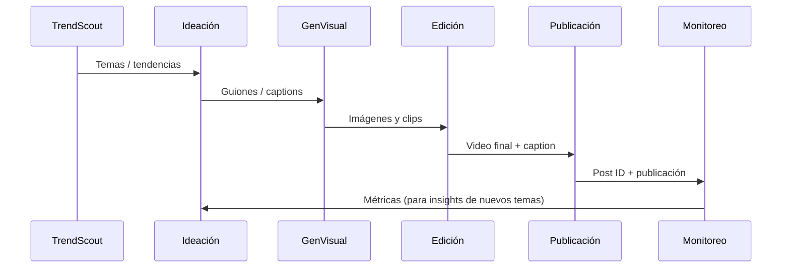
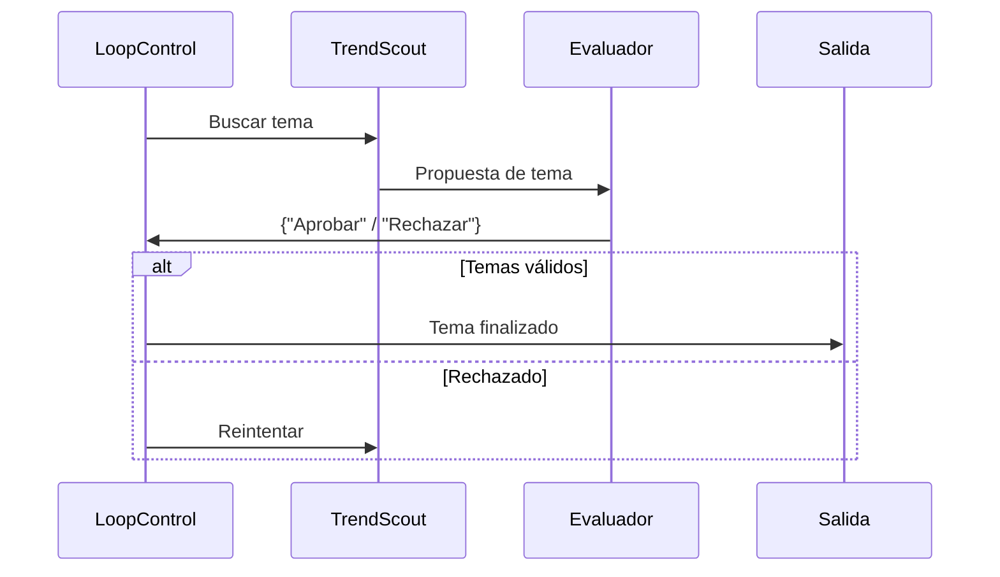

# Resumen Ejecutivo  
Este reporte describe un **sistema multi-agente** para automatizar la creación, publicación, monitoreo y optimización de contenido en Instagram. Se sugiere una arquitectura distribuida donde agentes especializados (Ideación, Generación de Texto/Imagen/Video, Publicación, Análisis y Optimización) colaboran de forma orquestada. Se detallan los flujos de trabajo (diagramas Mermaid), integraciones (APIs de Instagram, editores de video, LLM, TTS, etc.), pipelines de contenido (tendencias, guiones, multimedia, publicación, reposts) y métricas clave (retención, interacciones, crecimiento).  

Se incluyen bucles de optimización automática (A/B testing, aprendizaje por refuerzo, reglas de escalamiento), así como políticas de seguridad y cumplimiento (IP, claims médicos, límites de API) y una gobernanza operativa (roles humanos, revisión y auditoría). Se evalúan costos de infraestructura (hospedaje, GPUs, APIs) en tres niveles (hobby, startup, scale). Finalmente se propone un plan de 8 semanas con hitos semanales y checklist de validación en 30 días, plantillas de prompts para cada agente, ejemplos de reglas IF-THEN, y una tabla comparativa de herramientas (automatización, edición, IA) con pros/cons.

Este enfoque modular (e.g. con n8n para orquestación) aprovecha fuentes oficiales y bibliotecas líderes para lograr rápida iteración: p.ej. la API Graph de Instagram para publicación y métricas【12†L430-L438】【45†L89-L93】, editores automáticos como **CapCutAPI**【24†L438-L447】, motores de IA (OpenAI, Google, Stable Diffusion), servicios TTS/ASR (OpenAI TTS【31†L825-L833】, Google Text-to-Speech【34†L43-L50】), y frameworks de agentes (LangChain, AutoGen). El sistema es capaz de generar contenido escalable y optimizado (imágenes, Reels, captions, hashtags), medir su rendimiento (reach, watch time, CTR, conversions【49†L158-L160】), y adaptarse automáticamente. 

A continuación se describen detalladamente los componentes clave, riesgos y recomendaciones para implementar un MVP de cuenta automatizada en Instagram.

## 1. Arquitectura de Agentes  
Proponemos agentes especializados en cada fase del ciclo de contenidos. A modo de ejemplo:

| **Agente**               | **Responsabilidad**                                                      | **Inputs**                                  | **Outputs**                                  | **Frecuencia**       | **Dependencias**                                                 |
|--------------------------|--------------------------------------------------------------------------|---------------------------------------------|----------------------------------------------|----------------------|------------------------------------------------------------------|
| **TrendScout (Investigación)**   | Extrae tendencias actuales (hashtags, noticias, memes, etc.)                    | APIs de tendencias (Google Trends, Twitter), RSS, feeds de noticias, TikTok/IG trending     | Lista de temas y tendencias priorizados      | Diaria/varias veces al día | APIs de datos (Google Trends, News), scraping (con cuidado)       |
| **Ideación**             | Genera ideas de contenido y guiones (texto) basados en tendencias             | Temas de TrendScout, promptings de usuario                 | Títulos, captions, guiones de video          | Diaria/semanal       | LLM (OpenAI GPT, Llama), plantillas de prompts                    |
| **Generación Multimedia**| Crea activos visuales y de audio (imágenes, clips, voz) para el contenido     | Guiones de texto, tendencias; plantillas de estilo        | Imágenes (StableDiffusion, DALL·E), videos cortos (mashups, clips de stock, SoraAI), audio TTS   | Por pieza de contenido  | APIs de generación de imágenes (Stability, DALL-E), video libs (FFMPEG, CapCutAPI), TTS (OpenAI/Google) |
| **Edición / Montaje**    | Ensambla y edita clips, efectos, subtítulos y sincroniza audio/imagen         | Activos multimedia del anterior agente; metadatos (duración, formato) | Videos finales optimizados (Reels, carruseles, Stories)   | Por pieza de contenido  | Herramientas de edición (CapCutAPI【24†L438-L447】, FFMPEG, sistemas de render) |
| **Publicación**          | Programa y publica el contenido en Instagram usando Graph API                 | Videos finales, captions, hashtags                  | Publicaciones en IG (post ID, status)        | Programada/evento     | Instagram Graph API (“/media” + “/media_publish”), tokens de acceso (revisados por Meta) |
| **Monitoreo (Analista)** | Obtiene métricas de rendimiento (likes, views, CTR, retención)               | IDs de posts, Insights API                         | Base de datos con métricas históricas        | Diario después de publicaciones | Instagram Insights API, Google Analytics (para tráfico web)   |
| **Respuesta (Engagement)** | Gestiona interacciones: contesta automáticamente comentarios sencillos, filtra spam y críterios | Nuevos comentarios/DMs (webhooks de IG)         | Respuestas automáticas adecuadas, tickets de soporte | Tiempo real / cada hora | API de Comentarios de IG, AI moderador de texto (para detectar spam, queries frecuentes) |
| **Optimización (A/B / RL)**   | Analiza resultados (A vs B, variaciones de títulos o formatos) y decide ajustes futuros  | Datos de rendimiento almacenados             | Reglas de priorización (p.ej. mejor thumbnail), recomendaciones de contenidos similares  | Semanal/quincenal    | Algoritmos ML (bandit, aprendizaje reforzado), históricos de métricas |
| **Coordinador (Orquestador)** | Coordina ejecución de los agentes, manejo de colas y triggers                | Scripts de orquestación/workflows             | Flujo de tareas secuencial/iterativo         | Continuo             | Plataformas de orquestación (n8n, Airflow, Python scripts), colas (RabbitMQ, Celery) |
| **Human-in-the-Loop**   | Supervisa y aprueba contenido sensible, revisa calidad final                   | Contenido generado (imágenes, captions, videos) | Validaciones, correcciones humanas            | Según necesidades     | Panel de revisión (UI), flujos de aprobación internos (ej. Notion/Asana) |

Cada agente opera con herramientas especializadas (APIs, librerías o pipelines de IA) y comunica via colas o APIs internas. Por ejemplo, el Agente de Publicación activa un **Workflow de Publicación** que incluye: subir imagen/video por Graph API, luego crear media container y finalmente hacer “publish”【12†L430-L438】. El **Coordinador** (SequentialAgent/LoopAgent de LangChain o sistema similar【21†L89-L98】) maneja bucles (p.ej. repetir generación hasta aprobar calidad) y pasa datos entre agentes.

## 2. Flujos de Trabajo y Orquestación  
Los flujos secuenciales y de feedback se definen con diagramas Mermaid. Por ejemplo, el pipeline básico de creación puede representarse así:

También puede haber orquestadores de bucle, p.ej. `LoopAgent` que reitera investigación + crítica hasta validar un tema【21†L97-L105】:

Para datos, un **diagrama ER** mínimo incluiría tablas como *Post*, *Tendencia*, *Insignias (hashtags)*, *Métrica de Post*, *Usuario* y sus relaciones (un post pertenece a un hashtag, tiene métricas, etc.). Por brevedad, omitimos el detalle pero se usaría un modelo relacional simple (p.ej. Post(ID, caption, media_id, fecha) con Metrics(post_id, date, views, likes, coment,...)).

Los flujos técnicos incluyen: colas de tareas (p.ej. RabbitMQ o Redis) para desacoplar generación de publicación; triggers programados (cron/n8n) al iniciar pipelines diarios; reintentos automáticos en error (si falla Graph API); patrones pub/sub para notificaciones (p.ej. Slack/Email cuando se publica o detecta anomalía) y webhooks para captar eventos de Instagram (nuevos comentarios o seguidores).

## 3. Integraciones y APIs  
Se integran APIs oficiales y herramientas clave:

- **Instagram Graph API**: Endpoint de *Content Publishing* permite publicar fotos, carruseles, Reels (flujo de “create media” + “publish”)【12†L430-L438】. Requiere cuenta business/creator y permisos (`instagram_basic`, `instagram_content_publish` etc.), tokens de larga duración【5†L83-L91】. Límite: ~200 llamadas/media por hora (configurable).  
- **Instagram Insights API**: Para métricas (alcance, impresiones, likes, comentarios, guardados). Extrae datos diarios/semanales para dashboards.  
- **Meta Content Publishing**: Conjunto de APIs de Meta (Facebook/IG) para gestión de posts y stories. Se usa para programación avanzada (p.ej. carousels, reels)【12†L430-L438】.  
- **Herramientas de Scheduling**: Plataformas como Buffer, Hootsuite o Later permiten programar posts y ofrecen API. Por ejemplo, Buffer API puede encolar posts para Instagram automáticamente, como ilustra un workflow de n8n【45†L89-L93】. N8N, Zapier o Make pueden orquestar llamadas a estas APIs.  
- **Edición de Video**: 
  - **CapCutAPI**: Plataforma de edición automatizada compatible CapCut (desktop/mac) con API REST/MCP【24†L436-L445】. Permite crear proyectos, agregar video/audio, texto, transiciones, efectos y subtítulos programáticamente. Es útil para Reels y videos largos.  
  - **FFMPEG**: Herramienta de línea de comandos para manipular video/audio (recortes, concatenación, overlays). Libre y rápida, pero requiere scripts.  
  - **Alternativas**: Adobe Premiere Pro (Adobe API/SDK), Clipchamp API, OpenShot, etc. Sin embargo, CapCutAPI destaca por integración con IA (sprites, efectos AI).  
- **TTS (Texto a Voz)**: 
  - **OpenAI TTS API**: Produce audio realista (6 voces, modelo TTS-1 o TTS-1-HD)【31†L825-L833】. Límite ~50 req/min, $0.015–0.03 por 1k chars. Genera narraciones para videos o story audio.  
  - **Google Text-to-Speech**: Servicio de Google con >380 voces naturales en 75+ idiomas【34†L43-L50】 (incluye Español). Soporta SSML para personalizar entonación. AWS Polly / Azure Speech son alternativas similares.  
- **IA de Imágenes**:
  - **Stable Diffusion**: Modelo abierto para generar imágenes desde texto. Disponible vía API de Stability.ai (REST v2beta) o soluciones self-hosted. Se usa para portadas de carruseles o imágenes de apoyo.  
  - **DALL·E 3 (OpenAI)**: Produce imágenes de alta calidad vía API de OpenAI (requiere clave).  
  - **Midjourney**: Bot Discord para arte creativo, no tiene API oficial pública. Útil para contenido único (ajustable).  
- **LLMs (Lenguaje)**: 
  - **OpenAI GPT-4/5**: Generación de captions, guiones y respuestas. Amplia adaptabilidad y prompts.  
  - **Modelos locales**: Mistral, LLaMA3, Falcon, etc. Ejecución offline (PyTorch/Transformers) reduce costo por request y aumenta privacidad. Hugging Face lidera el ecosistema de LLMs open-source.  
- **Audio / Subtítulos**:
  - **Whisper (OpenAI)**: Modelo de ASR para transcribir audio a texto con alta precisión multilenguaje. Se usa para generar subtítulos en videos【31†L825-L833】. 
  - **AssemblyAI / Deepgram**: APIs comerciales de transcripción automática.  
- **Almacenamiento y CDN**:
  - **Hosting de medios**: Archivos multimedia (imágenes, videos generados) se almacenan en S3 (AWS) o Google Cloud Storage con CDN (CloudFront, Cloudflare) para entrega rápida.  
  - **Base de datos**: Para posts y métricas se usan RDS/Managed DB (MySQL/PostgreSQL) o NoSQL (Firestore, DynamoDB).  
  - **Cache/Broker**: Redis o RabbitMQ para colas internas (mensajería entre agentes).

Se priorizan fuentes oficiales (documentación Meta, docs.n8n.io, GitHub oficial de CapCutAPI, docs de AWS/Google, etc.) para garantizar compatibilidad y soporte. Por ejemplo, las políticas de limites de Instagram (límite de llamadas, permisos) se siguen según documentación de Meta【12†L430-L438】. 

## 4. Pipelines de Contenido  
Se define un pipeline end-to-end:

1. **Detección de tendencias (Feed)**: El Agente TrendScout recolecta noticias y tendencias (Twitter API, RSS de medios, Google Trends, hashtags en ascenso) en base a palabras clave definidas. Esto alimenta el **Pipeline de ideación** con datos frescos.  
2. **Ideación y guion**: Basado en tendencias, el agente **Ideación** usa un LLM para generar títulos atractivos, guiones de voz/captions y hashtags relevantes. P.ej. "Narrativa histórica en 60s: *** [Gancho con pregunta intrigante]". Se generan variantes A/B para probar.  
3. **Voiceover/Audio**: El guion aprobado se envía a la API TTS para crear un archivo de audio (voz narrativa). Se puede usar tono específico (casual, formal).  
4. **Generación Multimedia**:
   - **Imágenes**: Se solicitan imágenes alusivas con prompts adecuados a modelos IA (Stable Diffusion, DALL·E) para miniaturas o carruseles.  
   - **Video**: Se ensamblan clips cortos (stock, animaciones AI generadas por Sora 2/Gemini) según el guion. CapCutAPI recibe el audio + visuales para crear un video con subtítulos, transiciones y música de fondo.  
5. **Edición ligera**: CapCutAPI (o FFMPEG) ajusta colores, añade logos de marca, sincroniza audio/subtítulos. Genera la versión final en formato Instagram (Reel, carrusel o story).  
6. **Publicación**: El agente **Publicación** programa la publicación vía Graph API. Usa el flujo de dos pasos (upload container + publish)【12†L430-L438】. Publica en horarios óptimos (según analytics previos o pruebas A/B de horarios).  
7. **Reposts / Stories**: Se re-publican fragmentos del contenido (extractos del video) en Stories o reels secundarios para maximizar alcance. También se cross-postea en otras redes (TikTok, YouTube Shorts) usando APIs respectivas.  
8. **Feedback Loop**: El agente **Monitoreo** recoge métricas (imps, CTR, watch time) tras la publicación. El agente **Optimización** analiza qué hooks y contenidos funcionan mejor (p.ej. hook tipo sorpresa vs. pregunta). Luego actualiza prompts/reglas para el siguiente ciclo. Se ejecutan tests (título A vs B, miniatura X vs Y) automáticamente con algoritmo bandit.  

Este pipeline es repetible y escalable. Permite al equipo enfocarse en estrategia global y supervisión, mientras los agentes manejan la ejecución diaria.

## 5. Monitoreo y Métricas  
Las métricas clave de Instagram y video incluyen: **retención/tiempo de visualización (watch time)**, **engagement** (likes, comentarios, guardados, compartidos), **CTR** (click-through de CTA o perfil), **alcance e impresiones**, **crecimiento de seguidores** y **churn** (desincripción). Otros KPI útiles: **conversiones** (ventas / leads generados desde enlaces en bio) y **sentimiento** (análisis de texto de comentarios).

Se implementan tableros de control (Data Studio, Grafana o tools BI) consolidadas de Instagram Insights, Google Analytics (para tráfico web) y datos internos. Por ejemplo, plantillas de dashboards de Social Media muestran visitas, interacciones y desempeño de posts【49†L158-L160】. Se configuran alertas automáticas: e.g. tráfico súbito, caída de reach o spam detectado (anomalía). Se pueden aplicar ML de anomaly detection (Amazon SageMaker o BigQuery ML). 

Experimentos y tests A/B se monitorean con estadística (p.ej. diferencias de retención entre versiones). El sistema registra permanentemente logs de desempeño y crea históricos para alimentar el agente optimizador. Métricas de operación internas incluyen tiempos de latencia API, tasa de éxito de publicación, errores de contenido.

## 6. Bucles de Optimización Automática  
Para mejorar iterativamente, se emplean:

- **Tests A/B**: Variar *gancho inicial*, títulos y miniaturas. Usar aprendizaje por refuerzo o ε-greedy: por ejemplo, rotar entre las dos variantes de caption y medir cuál retiene más tiempo a los usuarios.  
- **Modelos Bandit/ML**: Un agente ajusta automáticamente qué thumbnail/hook usar basándose en historia de desempeño (como Multi-Armed Bandit). Por ejemplo, si en semanas anteriores los reels con escenas históricas obtuvieron +20% watch time, prioriza esa temática.  
- **Reglas IF-THEN**: Reglas básicas:  
  - Si engagement < 50% del promedio, “boostear” la publicación con ads o reposts.  
  - Si un hashtag genera >X nueva suscripción, priorizarlo.  
  - Si un video supera umbral (ej. 1M views en 24h), “replicarlo” en TikTok como Short.  
  - Suspender automatización si ciertos errores ocurren (p.ej. consecutivas fallas de API).  
- **Aprendizaje por Refuerzo**: Se puede entrenar un agente RL (p.ej. con AutoGen/Alpaca) para ajustar parámetros de contenido (duración óptima, tipos de efectos) maximizando KPI. No es trivial, pero posible usando simulaciones (e.g. predecir retención usando un modelo) y optimizar campañas.  
- **Feedback humano**: Los creadores revisan informes generados por el sistema (p.ej. sugerencias de temas emergentes). También moderan respuestas automatizadas si hay riesgo de malentendido.

## 7. Seguridad, Cumplimiento y Riesgos  
Se consideran riesgos legales y de reputación:

- **Desinformación / Claims médicos**: Instagram prohíbe contenido que promueva remedios no probados o consejos médicos sin base científica. Los agentes deben filtrar o añadir disclaimers para temas de salud/longevidad.  
- **Contenido financiero regulado**: Publicaciones sobre trading, criptos o economía pueden requerir avisos legales en ciertas regiones (p.ej. riesgo de inversiones). Es esencial cumplir con leyes locales (SEC, CNBV, etc.).  
- **Copyright / Propiedad Intelectual**: Usar imágenes/videos generados por IA puede infringir licencias. Se debe verificar la licencia de Stable Diffusion (restringe uso comercial si se usa modelo entrenado con imágenes no cedidas) y atribuir cuando sea necesario. No publicar obras con marca registrada sin permiso.  
- **Políticas de Instagram**: Evitar contenido sensible (hate, violencia, sexual) según normas comunitarias. También usar la API oficial en lugar de scraping para prevenir bans【12†L430-L438】. El posteo masivo excesivo puede activar *shadowban*.  
- **Límites de API**: Respetar límites de llamadas (p.ej. 200/60min para Graph API). Diseñar retires exponenciales ante errores 429.  
- **Privacidad y manejo de datos**: Si se recopilan comentarios/Datos de usuarios, cumplir GDPR/CCPA. No almacenar datos personales innecesarios.  
- **Dependencia de tendencias**: El sistema no debe sobreoptimizar solo lo viral; diversificar.  
- **Fatiga de audiencia**: Contenido repetitivo genera aburrimiento. Los agentes optimizadores deben medir tiempo de retención y variar formatos (p.ej. mezclar Reels cortos con carruseles largos).  
- **Riesgo de Spam**: Automatizar comentarios o mensajes directos puede ser etiquetado como spam si no se hace adecuadamente. Limitar cantidad de auto-replies (por ejemplo, Instagram permite ~750 mensajería std/h【53†L122-L129】) y personalizarlas lo más posible.  
- **Gestión de crisis**: Incluir proceso humano de revisión en temas sensibles. Registro de decisiones (audit trail) por transparencia.

## 8. Operación y Gobernanza  
- **Roles Humanos**: Aunque la automatización es amplia, se requieren supervisores (expertos de marca, moderadores) que validen contenido crítico. p.ej. un humano revisa scripts finales de video antes de aprobación.  
- **Revisión/Approval**: Antes de publicar temas sensibles (política, salud) el contenido pasa por workflow de aprobación (p. ej. en Notion o Asana) con checkpoints obligatorios.  
- **Escalamiento**: Definir escalas de problemas (errores técnicos, crisis de reputación) y cómo el agente alerta a humanos (Slack, email).  
- **Logging/Audit**: Todos los pasos (generación de contenido, publicaciones realizadas, cambios de algoritmo) se registran en logs para trazabilidad. Permite investigar fallos o detectar mal uso (por ejemplo, si el LLM generó contenido ofensivo).  
- **Guardrails Éticos**: Establecer límites a lo que puede generar (no imitaciones de figuras reales sin permiso, no difundir teorías conspirativas peligrosas). Incluir filtros de toxicidad en los prompts de generación.  
- **Capacitación Continua**: Registrar feedback humano para afinar prompts y reglas (meta-learnings).

## 9. Infraestructura y Costos Estimados  
**Recursos sugeridos** (escala Hobby / Startup / Scale):

- **Hosting y compute**:  
  - *Hobby*: VPS básico (AWS Lightsail / DigitalOcean) + GPU virtual (NVIDIA T4 a demanda) ~ $100–300/mes.  
  - *Startup*: Servidor dedicado / GCP Compute Engine GPU (1-2 GPUs, e.g. A100) ~ $1,000–3,000/mes.  
  - *Scale*: Infraestructura en la nube (clusters Kubernetes con autoscaling, GPU farm) ~ $5,000+/mes.  
- **Bases de datos y almacenamiento**:  
  - *Hobby*: MongoDB / PostgreSQL en instancia pequeña ($20–50/mes), S3 con poco uso (~$10/mes).  
  - *Startup*: Instancia RDS + CDN (CloudFront) + 1TB S3 ($200–500/mes).  
  - *Scale*: Multi-region DB y CDN, decenas TB ($1,000+/mes).  
- **APIs y servicios terceros**:  
  - OpenAI GPT-4/DALL-E: consumo aprox. $0.01–0.06/minuto de audio/video generado【31†L812-L820】. Para ~10 videos diarios (5 min total) puede ser $20–100/mes.  
  - TTS (OpenAI/Google): ~0.015–0.03$/1k caracteres【31†L812-L820】. Moderado.  
  - CapCutAPI (open-source): gratis, solo coste de la instancia servidor donde corre.  
  - Marketing: Buffer/Hootsuite (planes desde $15/mes) para estadísticas adicionales.  
- **CI/CD y Hosting de Aplicaciones**:  
  - Pipelines de despliegue (GitLab CI, GitHub Actions gratis o $20/mes).  
  - Domain, SSL (usualmente incluido).  
- **Costos totales mensuales estimados**:  
  - *Hobby*: ~ $200–$500.  
  - *Startup (Equipo pequeño)*: ~$1,000–$5,000.  
  - *Scale (Marca grande)*: $10,000+/mes, incluyendo escalado global, soporte continuo y redundancia.

Estos rangos incluyen todo, pero pueden variar. Una estrategia es comenzar con low-cost (servidores compartidos y APIs de consumo), medir ROI, y escalar solo donde haya valor claro (por ejemplo, invertir más GPU si los videos generan altos ingresos o leads).

## 10. Plan de Implementación (8 Semanas)  
**Semana 1-2:** Diseño detallado y entorno base  
- *Hito*: Documento de arquitectura final, setup de entornos (servidor, DB, almacenamiento). Configurar Facebook/Instagram Developer App, obtener tokens y permisos necesarios【12†L439-L448】.  
- *Entregable*: Skeleton de proyecto en Git (backend, colas, base de datos, test de conexión Graph API).  
- *Aceptación*: Se logran llamadas de prueba a IG Graph (e.g. obtención de perfil).

**Semana 3-4:** Agentes de investigación e ideación  
- *Hito*: Agente TrendScout conectado a APIs (Google Trends, RSS) y Agente Ideación con prompts base.  
- *Entregable*: Generador de temas y captions de prueba (usar GPT4 o LLaMA local).  
- *Aceptación*: Producción de al menos 5 ideas de contenido plausibles diarias.

**Semana 5:** Generación multimedia y edición  
- *Hito*: Integrar generación de imágenes (Stable Diff, DALL-E) y setup de CapCutAPI/FFMPEG pipeline.  
- *Entregable*: Videos prototipo de 30s (voz TTS + imágenes) montados automáticamente.  
- *Aceptación*: Video con audio sincronizado y subtítulos generado sin errores.

**Semana 6:** Publicación y monitoreo  
- *Hito*: Automático subir un post de prueba a Instagram usando la API (imagen + caption). Configurar agentes de obtención de métricas (Insights API).  
- *Entregable*: Dashboard básico con métricas dummy (ej. likes recuperados).  
- *Aceptación*: Post de prueba publicado (bajo una cuenta sandbox) y métricas visibles.

**Semana 7:** Orquestación completa y seguridad  
- *Hito*: Configurar el flujo completo (investigación → publicación). Definir roles humanos y flujos de aprobación. Añadir logs e intentos de reintento.  
- *Entregable*: Pipeline automático que publica un post diario si se aprueba.  
- *Aceptación*: Primer flujo end-to-end completado, con al menos un contenido publicado tras revisión.

**Semana 8:** Optimización y pruebas finales  
- *Hito*: Implementar un experimento A/B sencillo (dos versiones de caption/imagen). Incorporar alertas básicas (Slack/email).  
- *Entregable*: Reporte de métricas de prueba A/B y ajuste de proceso según resultados.  
- *Aceptación*: Validación de decisiones automáticas (p.ej. selección de variante ganadora) y sistema listo para escalar.

Cada semana incluye revisión con stakeholders y ajustes de prioridades. Se evalúa la funcionalidad clave (p.ej. “¿Generamos contenido de calidad?”) y el feedback alimenta la siguiente iteración.

## 11. Checklist de Pruebas y Métricas para MVP (30 días)  
- **PRUEBAS TÉCNICAS**:  
  - [ ] Publicar exitosamente posts ( imágenes, carruseles, reels) via API sin errores.  
  - [ ] Procesar y almacenar métricas (no pérdida de datos).  
  - [ ] Escalabilidad: probar carga de generación concurrente (p.ej. 3 posts automáticos en cola).  
  - [ ] Resiliencia: qué sucede si una API falla (deben existir retries/backoff).  
- **MÉTRICAS DE NEGOCIO**:  
  - Seguidores nuevos/día.  
  - Engagement rate (interacciones/alcance).  
  - Retención promedio de video (% completo).  
  - Tasa de conversión de llamadas a la acción (clicks en perfil/bio).  
- **CRITERIOS DE ÉXITO/PIVOT**:  
  - Si el crecimiento de seguidores < X% en 30d, revisar estrategia de contenido.  
  - Si engagement es bajo (< benchmark de industria ~2–3%), probar nuevos formatos.  
  - Si el costo de operación >> ingresos/valor (como leads generados), re-evaluar invest en IA.  
  - Si cualquier componente clave falla repetidamente (e.g. la generación de video siempre demora >1h), considerar alternativas o simplificar flujo.

## 12. Plantillas de Prompts y Reglas Automáticas  
**Prompts ejemplo** (cada agente puede usar uno similar):  
- *Ideación*: “Eres un copywriter experto en historia. Genera un caption impactante (ganchos breves, voz narrativa) para una publicación de Instagram sobre *La caída del Imperio Azteca* en 60 caracteres.”  
- *Generación de voz*: “Crea un guión de voz en español, tono emotivo, contando en 15s la trama de este caption: *…*.”  
- *Imagen IA*: “Genera una imagen de *atardecer prehispánico con guerreros aztecas* en estilo cinematográfico.”  
- *Respuesta a comentario*: “Responde de forma amable y breve a este comentario de usuario: *¿Viene con sorbete?*”.  

**Reglas IF-THEN** (optimización):  
- IF **CTR < 1%** Y **imps alto**, THEN “cambia el hook inicial” (e.g. pregunta intrigante).  
- IF **likes/comentarios < 100** en 48h, THEN “reevaluar hashtags y repost en Stories”.  
- IF **video retención > 50%** en promedio, THEN “duplicar formato similar en próxima iteración”.  
- IF **nuevo seguidor/usser** proviene de X ubicación de país, THEN “intentar incluir hashtags/regionalización de contenido”.  
- IF **error en API**, THEN “reintentar hasta 3 veces con tiempo exponencial; notificar humano si persiste”.

## 13. Comparativa de Herramientas  

| **Herramienta**         | **Función**             | **Pros**                      | **Contras**               | **Coste aprox.**             | **Link**                                             |
|-------------------------|-------------------------|------------------------------|---------------------------|-----------------------------|------------------------------------------------------|
| **n8n**                 | Orquestación (workflow) | Muy flexible; +9500 integraciones; código abierto【45†L74-L83】 | Curva aprendizaje; hosting propio (o plan cloud pago) | Gratis OSS; cloud desde ~$20/mes | [n8n.io](https://n8n.io)                             |
| **Buffer / Hootsuite**  | Programar posts        | API fácil; soporte multiplataforma | Planes caros para muchas cuentas | Desde ~$15/mes | [buffer.com](https://buffer.com), [hootsuite.com](https://hootsuite.com) |
| **CapCutAPI**           | Edición de video programática【24†L438-L447】 | Integración IA; multiplataforma (Win/mac); edición avanzada | Proyecto en desarrollo; requiere Python | OSS gratuito (solo infra)     | [GitHub:CapCutAPI](https://github.com/ashreo/CapCutAPI) |
| **FFMPEG**              | Edición video/Audio    | Muy potente; multimedia amplia | Requiere scripting; no GUI | Gratis (open source) | [FFmpeg.org](https://ffmpeg.org)                      |
| **OpenAI GPT-4/5**      | Generación de texto IA  | Calidad muy alta; adaptación contextual | Coste por token; dependiente de API (latencia) | $$$ (depende uso, e.g. $0.06/1K tok) | [openai.com](https://openai.com/api)                  |
| **HuggingFace LLMs**    | Modelos de texto locales| Gratuitos o de bajo coste; offline (privacidad) | Necesita hardware GPU; variabilidad en calidad | OSS o variables (callejeo de cloud vs local) | [huggingface.co](https://huggingface.co)              |
| **Stable Diffusion (API)** | Generación de imágenes IA | Gratis en local; Varios estilos | Variabilidad; riesgo de IP | Gratis local; Cloud ~$0.10/imagen (est.) | [stability.ai](https://platform.stability.ai)        |
| **DALL·E 3 (OpenAI)**   | Imágenes IA             | Alta fidelidad; fácil uso | Costoso (requiere suscripción API) | Alto ($; similar a GPT) | [openai.com/dall-e](https://openai.com/dall-e-3)      |
| **ElevenLabs TTS**      | Voz IA natural         | Varios idiomas/voces; streaming | Plan gratuito limitado; pago alto por voz HD | Desde $5/mes (nivel básico) | [elevenlabs.io](https://elevenlabs.io)               |
| **Google Cloud TTS**    | Voz IA natural【34†L43-L50】 | 380+ voces; soporte SSML; confiable | Estructura de precios compleja | ~$4/1M chars (est. 380 voces) | [cloud.google.com/text-to-speech](https://cloud.google.com/text-to-speech) |
| **OpenAI Whisper**      | Transcripción audio    | Precisión alta multilenguaje | Modelo grande (ggml ~1GB); latencia alto en CPU | Gratis OSS; Cloud $    | [github.com/openai/whisper](https://github.com/openai/whisper) |
| **Porter Metrics**      | Dashboards Social Media【49†L158-L160】| Plantillas gratuitas; Data Studio integr. | Centrado en informes; no automatización | Plan gratuito/B2B | [portermetrics.com](https://portermetrics.com)        |
| **AWS S3 + CloudFront** | Almacenamiento y CDN   | Escalable; global; pay-as-you-go | Coste sube con volumen; configuración | ~$23/TB + tráfico (estimado) | [aws.amazon.com/s3](https://aws.amazon.com/s3/)      |
| **Cloudflare R2**       | Almacenamiento/CDN     | Sin egress fees; rápido | Integración extra; cuota | Desde $0.015/GB+ | [cloudflare.com/products/r2](https://cloudflare.com/products/r2/) |

Esta tabla ofrece una visión comparativa de herramientas clave: integraciones de orquestación (n8n), edición (CapCutAPI vs FFMPEG), APIs de IA (GPT vs open source, DALL-E vs StableDiffusion), TTS, transcripción y hosting. Se elige en función de presupuesto, escalabilidad y complejidad del proyecto. Por ejemplo, CapCutAPI es ideal para edición avanzada con poco código (versus FFMPEG que requiere más desarrollo).

## 14. Recomendaciones Finales  
- **Stack Sugerido**: Plataforma de orquestación **n8n** (para conectar agentes y APIs sin código), base de datos **PostgreSQL/MongoDB**, servidor backend en **Python/Node** (para lógica de agentes), modelos LLM/IA alojados en **OpenAI** (rápido prototipado) combinados con modelos locales **LLaMA/Mistral** para reducir costos, CapCutAPI para edición de video automatizada【24†L438-L447】, y hosting en AWS/GCP con CDN (para medios).  
- **Riesgos Críticos**: Dependencia de APIs externas (rate limits de IG, cambios de política), possible **shadowban** si se abusa de automatización【53†L122-L129】, precisiones de IA (falsos positivos en discurso), cumplimiento legal (p.ej. DMCA).  
- **Mitigaciones**: Implementar control de tasa (backoff en API), revisión manual aleatoria de contenido, seguimiento de hashtags prohibidos, limpiar metadata de usuarios sensibles. Contar con asesoría legal si se trata contenido regulado.  
- **Pasos Siguientes**: Validar idea con un MVP sencillo: publicar manualmente algunos contenidos generados y comparar con manuales. Ajustar agents según feedback real. Iterar prompts con datos de performance real.  
- **Conclusión**: La automatización inteligente con multi-agentes y IA permite **escalar la generación de contenido** y centrarse en estrategia. Usar plantas modulares de agentes (como proponen LangChain/AutoGen【21†L93-L100】) facilita iteraciones. Con la arquitectura propuesta y siguiendo prácticas de seguridad/cumplimiento, es factible lanzar un sistema semi-autónomo en Instagram que maximice retención y engagement, al tiempo que mantiene la flexibilidad de revisión humana.  

**Fuentes destacadas:** Documentación oficial de Meta (Instagram Graph API)【12†L430-L438】, ejemplos de flujos n8n【45†L74-L83】, guías de servicios (OpenAI TTS【31†L825-L833】, Google TTS【34†L43-L50】) y repositorios como CapCutAPI【24†L438-L447】. También se consultaron benchmarks de métricas【49†L158-L160】 y mejores prácticas de automatización en Instagram【53†L122-L129】 para diseñar este reporte estratégico.  

